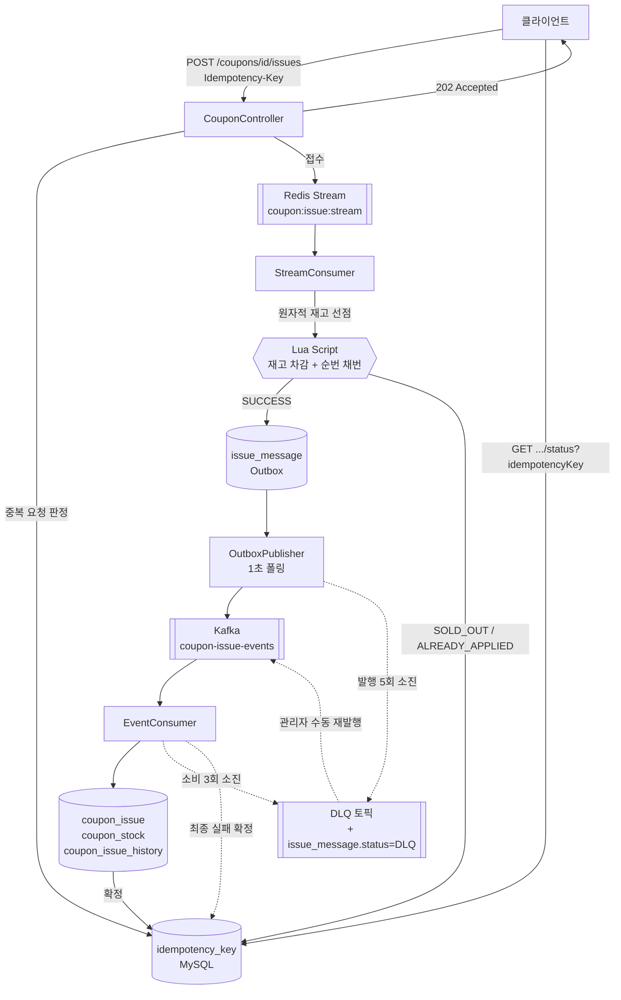

# petcoupon-backend

**선착순 쿠폰 발급 시스템** — 수만 명이 동시에 몰려도 초과 발급 0건, 1인 1매를 보장한다.


---

## 목적별 바로가기

| 하고 싶은 것 | 가는 곳 |
|---|---|
| 일단 실행해 보기 | [빠른 시작](#빠른-시작) |
| 어떻게 동작하는지 알기 | [발급 파이프라인](#발급-파이프라인) |
| API 붙이기 | [API](#api) |
| 관리자 API 호출하기 | [관리자 인증](#관리자-인증) |
| 성능 튜닝·부하 테스트 | [설정](#설정) · [부하 테스트 시나리오](load-test/docs/load-test-scenario.md) |
| 테스트 추가하기 | [테스트](#테스트) |
| 누가 뭘 맡았는지 | [팀 구성](#팀-구성) |
| 코드 기여하기 | [코딩 컨벤션](#코딩-컨벤션) · [협업 규칙](#협업-규칙) |

---

## 빠른 시작

의존 서비스를 띄운다. Kafka는 프로파일로 분리돼 있어 `--profile kafka`가 필요하다.

```bash
docker compose --profile kafka up -d
```

애플리케이션을 실행한다.

```bash
./gradlew bootRun
```

동작을 확인한다.

```bash
curl -s localhost:8080/actuator/health
```

부하 테스트용 더미 회원 100만 명이 필요하면 시드를 넣는다.

```bash
docker cp load-test/sql/seed_users.sql petcoupon-mysql:/tmp/ && docker exec petcoupon-mysql mysql -uroot -proot petcoupon -e "source /tmp/seed_users.sql"
```

---

## 발급 파이프라인

요청을 **접수**하는 구간과 발급을 **확정**하는 구간이 분리돼 있다.



| 단계 | 역할 | 실패하면 |
|---|---|---|
| Idempotency-Key | 같은 키의 재전송을 한 번만 반영하고 저장된 응답을 재현 | 409 (처리 중 / 키 재사용) |
| Redis Stream | 요청을 대기열에 적재해 API 응답을 재고 판정과 분리 | 503 (접수 실패) |
| Lua Script | 재고 차감 · 순번 채번 · 신청자 기록을 **원자적으로** 실행 | ACK하지 않고 pending 유지 |
| Outbox | Kafka 발행 대상을 DB에 먼저 기록해 유실 방지 | 1초 뒤 재발행, 5회 소진 시 DLQ |
| Kafka Consumer | 발급 · 재고 확정 · 이력을 한 트랜잭션으로 기록 | 1초 간격 2회 재시도 후 DLQ |
| DLQ | 자동 처리를 포기한 메시지를 보관 | 관리자가 목록 확인 후 수동 재발행 |

### 동시성을 무엇으로 막는가

| 장치 | 막는 것 |
|---|---|
| Lua 원자 실행 | 재고 확인과 차감 사이 끼어들기 |
| `uk_issue_coupon_user` | 1인 2매 (DB 최종 보증) |
| `uk_issue_sequence` | 쿠폰별 순번 중복 |
| `request_id` 유니크 | Kafka 재전달로 인한 중복 저장 |
| `idempotency_key` | API 레벨 재전송 |
| 조건부 UPDATE | 사용·취소·만료 동시 요청 (하나만 성공) |
| 비관적 락 | 관리자 수정과 스케줄러·발급의 경합 (`coupon → coupon_stock` 순서) |

---

## 관리자 인증

`/admin/**` 전체가 세션 토큰으로 보호된다. 공유 인증 코드로 **단기 토큰**을 발급받아 헤더에 실어 보낸다.

인증 코드는 팀이 공유하는 장기 비밀이라 브라우저·로그에 돌아다니면 안 된다.
그래서 코드는 세션을 받을 때 한 번만 쓰고, 이후 요청은 만료되는 토큰으로 처리한다.

**1. 토큰 발급** — `201` (이 엔드포인트만 토큰 없이 호출할 수 있다)

```bash
curl -s -X POST localhost:8080/admin/auth/sessions -H "Content-Type: application/json" -d '{"authCode":"local-dev-admin-auth-code"}'
```

**2. 이후 모든 관리자 요청에 `X-ADMIN-KEY` 헤더를 붙인다**

```bash
curl -s localhost:8080/admin/events/1 -H "X-ADMIN-KEY: {발급받은_토큰}"
```

**3. 토큰이 유출되면 즉시 폐기한다** (만료를 기다리지 않아도 된다)

```bash
curl -s -X DELETE localhost:8080/admin/auth/sessions -H "X-ADMIN-KEY: {발급받은_토큰}"
```

| 항목 | 값 |
|---|---|
| 헤더 | `X-ADMIN-KEY` |
| 기본 유효 기간 | 8시간 (`ADMIN_SESSION_TTL`) |
| 인증 코드 | `ADMIN_AUTH_CODE` (미설정 시 `/admin/**` 전체가 닫힘) |
| 저장 위치 | Redis (토큰 해시를 키로 저장, 평문 미보관) |

> `/internal/**`은 부하 테스트 전용이라 이 인증 대상이 아니며, `prod` 프로파일에서는 아예 비활성이다.

---

## API

모든 응답은 `CustomResponse`로 감싼다.

```json
{ "isSuccess": true, "code": "200", "message": "OK", "result": {} }
```

에러 코드는 `{DOMAIN}{STATUS}-{순번}` 규칙을 따른다 — `COUPON409-0`, `EVENT404-0` 등.

### 사용자

| Method | Path | 설명 |
|---|---|---|
| `GET` | `/events` | 공개 이벤트 목록 — `OPEN` 상태만 최신 등록순으로 조회 |
| `POST` | `/coupons/{couponId}/issues` | 선착순 신청 (`Idempotency-Key` 헤더 필수) → `202` |
| `GET` | `/coupons/{couponId}/status` | 쿠폰 실시간 요청 현황 — 잔여 재고는 Redis 기준. `initialized`가 `false`면 아직 재고 키가 없다는 뜻이라 `remainingQuantity: 0`을 품절로 읽으면 안 된다 |
| `GET` | `/users/{userId}/coupon-issue-requests/status?idempotencyKey=` | 신청 결과 폴링 |
| `GET` | `/users/{userId}/coupon-issue-requests` | 내 발급 신청 내역 |
| `GET` | `/coupon-issues/{couponIssueId}` | 발급 쿠폰 상세 |
| `GET` | `/coupon-issues/{couponIssueId}/status` | 발급 쿠폰 상태 |
| `POST` | `/coupon-issues/{couponIssueId}/use` | 쿠폰 사용 |
| `POST` | `/coupon-issues/{couponIssueId}/cancel` | 사용 취소 |

### 관리자 — `X-ADMIN-KEY` 필요

| Method | Path | 설명 |
|---|---|---|
| `POST` | `/admin/auth/sessions` | 세션 토큰 발급 (**토큰 불필요**) |
| `DELETE` | `/admin/auth/sessions` | 세션 폐기 |
| `GET` | `/admin/events` | 전체 이벤트 목록 — 모든 상태를 최신 등록순으로 조회 |
| `POST` | `/admin/events` | 이벤트 생성 |
| `GET` | `/admin/events/{eventId}` | 이벤트 상세 |
| `GET` | `/admin/events/{eventId}/status` | 이벤트 상태 |
| `PATCH` | `/admin/events/{eventId}` | 이벤트 수정 |
| `PATCH` | `/admin/events/{eventId}/status` | 이벤트 상태 변경 |
| `POST` | `/admin/events/{eventId}/coupons` | 쿠폰 생성 |
| `PATCH` | `/admin/events/{eventId}/coupons/{couponId}` | 쿠폰 수정 (발급 시작 전에만) |
| `GET` | `/admin/coupons` | 쿠폰 목록 — 페이지 단위. 선택 필터 `eventId`·`status`, 미지정 시 전체. 재고는 DB(`coupon_stock`) 확정값 |
| `GET` | `/admin/coupons/{couponId}/status` | 쿠폰 실시간 현황 — 잔여 재고는 Redis 기준 |
| `GET` | `/admin/coupon-issue/dlq` | DLQ 메시지 목록 |
| `POST` | `/admin/coupon-issue/dlq/{messageId}/reprocess` | DLQ 수동 재발행 |
| `POST` | `/admin/coupons/{couponId}/reconcile` | 정합성 검증 배치 실행 |

목록과 단건은 재고의 출처가 다르다. 목록은 Kafka 소비까지 끝난 **확정 발급 현황**(`coupon_stock`)이라
발급이 몰리는 동안에는 실시간 잔여와 어긋난다. 실시간 값이 필요하면 단건 조회를 쓴다.
목록에서 쿠폰마다 Redis를 읽으면 20건 목록에 왕복이 20회 생기고, 쿠폰 한 건의 정합성 오류가
페이지 전체를 실패시키기 때문이다.

재고 갱신 시각은 목록에 싣지 않는다. 발급 확정에 쓰는 `increaseIssuedQuantity`가 벌크 UPDATE라
`coupon_stock.updated_at`이 갱신되지 않아, 수량이 바뀌어도 그 시각은 쿠폰 생성 또는 총수량 수정
시점에 머문다. 기준 시각으로 오해할 값이라 갱신 경로를 고친 뒤에 추가한다.

```bash
curl -s "localhost:8080/admin/coupons?eventId=1&status=ACTIVE&page=0&size=20" -H "X-ADMIN-KEY: {발급받은_토큰}"
```

`page`는 0부터, `size`는 `10`·`20`·`50`·`100` 중 하나다(기본 20). 벗어나면 `COUPON400-11`이고,
페이지 응답 형식(`content`·`page`·`size`·`totalElements`·`totalPages`·`first`·`last`)은 이벤트 목록과 같다.
없는 `eventId`로 필터하면 빈 목록이 아니라 `EVENT404-0`으로 답한다.

`status=SOLD_OUT`은 재고 소진 즉시가 아니라 상태 전이 스케줄러 주기(최대 60초) 이후에 반영된다.
판정 기준이 Redis 실시간 값이 아니라 DB(`coupon_stock`) 확정값이기 때문이다.

### 내부 — `prod` 프로파일에서 비활성

| Method | Path | 설명 |
|---|---|---|
| `POST` | `/internal/coupons/{couponId}/reset` | 부하 테스트 회차 초기화 — DB 발급 데이터 삭제 + Redis 발급 상태 재설정 |

앞 회차 메시지가 파이프라인에 남아 있으면 `409`로 거절한다. 남은 메시지가 뒤늦게 처리되면서
이번 회차 재고를 깎기 때문이다. 사람이 판단해 넘겨야 할 때만 `force: true`로 강행한다.
응답의 `redisStock`은 초기화 후 Redis에서 다시 읽은 값이라, `totalQuantity`와 다르면 초기화가 덜 끝난 것이다.

---

## 배치 · 스케줄러

| 작업 | 주기 | 설명 |
|---|---|---|
| Outbox 발행 | 1초 (fixed delay) | `PENDING`·`FAILED` 메시지를 Kafka로 |
| 쿠폰 상태 전이 | 60초 | `READY → ACTIVE → SOLD_OUT → ENDED` (재고 소진은 DB 확정값 기준, `ACTIVE → ENDED`도 가능) |
| 이벤트 상태 전이 | 매분 | `SCHEDULED → OPEN → CLOSED` |
| 쿠폰 만료 | 매일 01:00 | 만료 건을 `EXPIRED`로 (청크 처리) |
| 멱등키 정리 | 매일 04:00 | 보관기간 7일 경과분 삭제 |

`TaskScheduler` 빈이 여러 개라 스케줄러마다 전용 스레드 풀을 명시한다.
공유 레지스트라를 쓰면 다른 작업까지 같은 풀로 끌려간다.

---

## 설정

전부 환경변수로 덮어쓸 수 있고, 기본값은 로컬에서 바로 뜨도록 맞춰져 있다.

| 환경변수 | 기본값 | 설명 |
|---|---|---|
| `DB_URL` · `DB_USERNAME` · `DB_PASSWORD` | localhost:3306 · root · root | MySQL 접속 |
| `REDIS_HOST` · `REDIS_PORT` | localhost · 6379 | Redis 접속 |
| `KAFKA_BOOTSTRAP_SERVERS` | localhost:9092 | Kafka 브로커 |
| `ADMIN_AUTH_CODE` | 개발용 기본값 | 관리자 세션 발급 코드. **배포 전 반드시 설정** |
| `ADMIN_SESSION_TTL` | `PT8H` | 세션 토큰 유효 기간 (ISO-8601 Duration) |
| `JPA_DDL_AUTO` | `update` | 엔티티 변경을 스키마에 자동 반영 |
| `DB_POOL_SIZE` | 10 | HikariCP 풀. **워커 스레드와 함께 올려야 한다** |
| `TOMCAT_MAX_THREADS` | 200 | Spring Boot 기본값 |
| `ACTUATOR_ENDPOINTS` | `health,info,metrics` | 노출할 Actuator 엔드포인트 |
| `ISSUE_LOG_LEVEL` | `INFO` | 부하 테스트 시 `WARN`으로 낮춤 |
| `EVENT_STATUS_SCHEDULER_ENABLED` | `true` | 테스트에서 끄는 용도 |
| `COUPON_STATUS_SCHEDULER_ENABLED` | `true` | 테스트에서 끄는 용도 |

---

## 프로젝트 구조

```
src/main/java/com/mycom/petcoupon/
├── coupon/              쿠폰 · 발급 (핵심 도메인)
│   ├── issue/           발급 파이프라인
│   │   ├── config/      Redis Stream · Kafka · Lua 설정
│   │   ├── producer/    Stream 발행, Kafka 발행
│   │   ├── consumer/    Stream 소비, Kafka 소비, DLQ 처리
│   │   └── service/     Lua 실행, 쿠폰코드 생성
│   ├── controller/ service/ repository/ entity/ dto/ converter/
│   └── config/          만료 배치 · 상태 전이 스케줄러
├── event/               이벤트 (쿠폰의 상위 개념)
├── idempotency/         API 레벨 멱등성 원장
├── messaging/           Outbox (issue_message)
├── reconciliation/      정합성 검증 배치
├── notification/        알림 로그
├── user/                사용자
└── global/              공통 응답 · 예외 · 설정
    └── auth/            관리자 세션 인증 (인터셉터 · 토큰 발급)
```

계층은 `controller → service / serviceImpl → repository`, 변환은 `converter`가 전담한다.

---

## 테스트

```bash
./gradlew test
```

통합 테스트가 **실제 MySQL · Redis · Kafka에 붙는다.** 실행 전에 의존 서비스를 띄워야 한다.

새 `@SpringBootTest`를 추가할 때는 스케줄러를 꺼야 한다. Spring은 테스트 컨텍스트를 캐시하고
클래스가 끝나도 닫지 않으므로, 스케줄러가 살아 있는 컨텍스트가 하나라도 있으면
빌드가 끝날 때까지 다른 테스트의 데이터를 건드린다.

```java
@SpringBootTest(properties = {
    "event.status.scheduler.enabled=false",
    "coupon.status.enabled=false"
})
```

---

## 문서

| 문서 | 내용 |
|---|---|
| [통합 테스트 시나리오](load-test/docs/integration-test-scenario.md) | TC 목록과 기대 동작 |
| [부하 테스트 시나리오](load-test/docs/load-test-scenario.md) | 단계별 부하 구성과 목표 지표 |
| [멘토링 질문](docs/mentoring-questions.md) | 설계 판단에 대한 미해결 논의 |
| [PR 템플릿](.github/pull_request_template.md) | PR 작성 형식 |

---

## 코딩 컨벤션

<details>
<summary><b>네이밍 · 계층 · DTO · 응답 · 예외 · 스타일 · 주석</b> (펼쳐보기)</summary>

<br>

### 네이밍

| 대상 | 규칙 | 예시 |
|---|---|---|
| Class | PascalCase | `CouponService` |
| Method | camelCase (동사 시작) | `issueCoupon()` |
| Variable | camelCase | `userId` |
| Constant | UPPER_SNAKE_CASE | `MAX_COUPON_COUNT` |
| Package | 소문자 | `coupon`, `issue`, `global` |
| JoinColumn | `참조테이블명_id` | `coupon_id` |

### 계층과 구조

- 도메인형 패키지 구조를 쓴다 — [프로젝트 구조](#프로젝트-구조) 참고
- `Controller → Service → Repository` 순으로만 의존한다
- **Entity를 직접 반환하지 않는다.** DTO로 변환해서 내보낸다
- Entity ↔ DTO 변환은 `Converter`가 전담한다
- DI는 생성자 주입(`@RequiredArgsConstructor`)을 쓴다
- Entity에 Setter를 두지 않는다. 상태 변경은 의도가 드러나는 메서드로 만든다
- 연관관계는 `FetchType.LAZY`가 기본이다
- `@Transactional`은 Service 계층에 붙인다

### DTO

- `record`로 작성한다
- 요청·응답을 `dto/req`, `dto/res`로 분리한다
- 이름은 `도메인 + 행위 + Request` / `도메인 + 행위 + Response` (`CouponCreateRequest`)

### API 응답

모든 API는 `CustomResponse<T>`를 반환한다.

```java
CustomResponse.onSuccess(result);                    // 200
CustomResponse.onSuccess(HttpStatus.CREATED, result); // 상태 지정
CustomResponse.onFailure(errorCode);                  // 에러 코드 기반
```

사용 가능한 메서드는 [`global/common/CustomResponse`](src/main/java/com/mycom/petcoupon/global/common/CustomResponse.java)를 기준으로 한다.

### 예외

- 공통 처리는 `@RestControllerAdvice`(`GlobalExceptionHandler`)가 맡는다. `try-catch`는 필요한 경우에만 쓴다
- 커스텀 에러 코드는 `{domain}/exception/{Domain}ErrorCode.java`에 `BaseErrorCode`를 구현한 `Enum`으로 둔다
- 코드 체계는 `{DOMAIN}{HTTP_STATUS}-{순번}` (0-base) — `COUPON400-0`, `USER404-0`

### 코드 스타일

- Indent 4 Spaces, 한 줄 120자 이하, IntelliJ Code Format 사용
- 하나의 메서드는 하나의 역할만 수행한다

### 주석

위치는 어노테이션 위·코드 위·코드 옆 중 자유롭게 쓴다.
이 레포는 "무엇을"보다 **"왜"** 를 남기는 관행을 따른다 — 특히 트랜잭션 경계를 나눈 이유,
락을 잡은 이유와 **잠그는 순서**, 기본 동작 대신 다른 선택을 한 이유(`@DynamicUpdate` 등),
예외를 삼키거나 재전파하는 이유는 근거를 적는다.

</details>

---

## 팀 구성

| 담당자 | 역할 | 핵심 업무 | 핵심 기술 | 담당 시나리오 |
|---|---|---|---|---|
| **전송흔** | 이벤트·쿠폰 관리 + 오픈 제어 | 이벤트 생성/수정, 쿠폰 생성·재고 관리, 오픈 시각 설정, 관리자 현황 조회 | JPA, Scheduler, SSE | TC-01~06, 20~29 (16) |
| **이성집** | 선착순 신청 + 멱등성 | 선착순 신청 API, 중복 신청 방지, 예약 취소, 발급 결과 조회, 멱등성 처리 | Transaction, Redis 연동, Idempotency | TC-07~10, 30, 33, 38, 43 (8) |
| **박수빈** | Redis · 동시성 | 재고 원자 차감/복구, 1인 1매, Lua, 동시 요청 제어, Redis 기반 대기열 | Redis, Lua, 동시성 | TC-31~32, 40~42, 44, 90~94 (10) |
| **정자비** | Kafka · 비동기 처리 | Producer/Consumer, DB 저장, 비동기 확정, Retry/DLQ Mock 알림 | Kafka, Async | TC-70~76 (7) |
| **박신형** | 쿠폰 상태 + 정합성 | 쿠폰 사용/취소/만료, 상태 전이, 이력·재고 검증, 300만 건 검증 로직 | JPA, Batch/Query, 조건부 UPDATE | TC-11~12, 34~37, 45~46, 50~66, 85 (24) |
| **함세연** | 대량 데이터 + 성능 + 공통 인프라 | 100만/300만 더미 데이터, 부하테스트, Docker, 모니터링, 개인정보 마스킹 | k6, Docker, Monitoring | TC-55~56, 80~84 (7) |

담당 시나리오의 전체 내용은 [통합 테스트 시나리오](load-test/docs/integration-test-scenario.md)에 있다.
시나리오가 실패하면 **그 기능의 담당자가 확인**한다. 테스트 코드에는 시나리오 ID를 주석으로 남긴다.

```java
// TC-45: 동일 발급 건에 사용 동시 호출
@Test
void onlyOneUseSucceedsWhenCalledConcurrently() { ... }
```

---

## 협업 규칙

<details>
<summary><b>작업 순서 · 브랜치 · 커밋 · PR · Merge 규칙</b> (펼쳐보기)</summary>

<br>

```
Issue 생성 → 번호 확인 → Branch 생성 → 개발 → Commit → PR → Code Review → dev Merge → Issue Close
```

| 구분 | 형식 | 예시 |
|---|---|---|
| 브랜치 | `{type}/{이슈번호}-{기능명}` | `feat/12-coupon-issue` |
| 이슈 제목 | `[Type] 작업 내용` | `[Feat] 쿠폰 발급 API 구현` |
| 커밋 | `type: 구체적인 변경 내용` | `feat: 쿠폰 발급 기능 구현` |
| PR 제목 | `[TYPE] 작업 내용 (#이슈번호)` | `[FEAT] 쿠폰 발급 기능 구현 (#12)` |

type: `feat` 기능 추가 · `fix` 버그 수정 · `refactor` 리팩토링 · `docs` 문서 ·
`style` 코드 스타일 · `test` 테스트 코드 · `chore` 설정 및 기타 작업

브랜치는 용도별로 나눈다.

| Branch | 용도 |
|---|---|
| `main` | 최종 배포 및 안정 버전 |
| `dev` | 개발 내용 통합 |
| `feat/` | 새로운 기능 개발 |
| `fix/` | 버그 수정 |
| `hotfix/` | 긴급 버그 수정 |
| `release/` | 배포 준비 |

### 지켜야 할 것

- 작업 시작 전 GitHub Issue를 먼저 만든다
- `main`, `dev`에는 직접 Push하지 않는다
- 하나의 Commit에는 하나의 작업만 담는다
- 커밋 메시지에 `코드 수정`, `기능 수정` 같은 포괄적 표현을 쓰지 않는다. 무엇을 어떻게 바꿨는지 적는다
- **최소 1명 이상의 코드 리뷰**를 받고 Merge한다
- Merge 전 최신 `dev`를 반영해 충돌을 해결한다
- Merge는 **Squash Merge**를 쓴다
- Merge 후 해당 Issue를 Close한다

</details>
