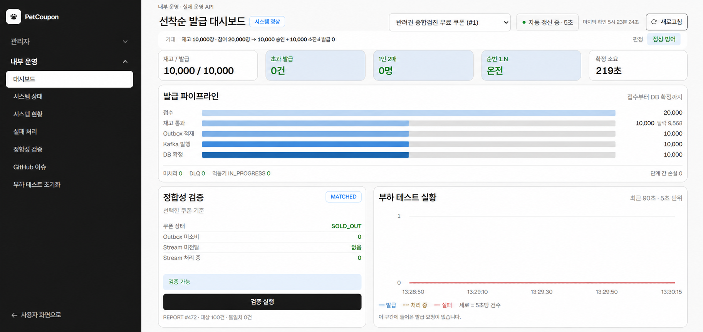
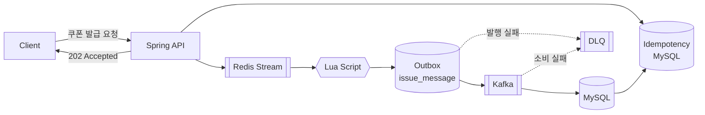

# 🎫 petcoupon-backend

> **선착순 쿠폰 발급 시스템**
> 대규모 동시 요청 상황에서도 **초과 발급 0건**과 **1인 1매**를 보장하는 쿠폰 발급 백엔드입니다.

<a href="https://app.notion.com/p/06-3b40be1e2d6a8092a7d5c1f8b9008869">
  
</a>

---

## 📌 프로젝트 소개

PetCoupon은 이벤트에 연결된 한정 수량 쿠폰을 선착순으로 발급하는 시스템입니다.
단순히 DB 재고를 차감하는 방식이 아니라, 다음을 조합해 높은 동시성 환경에서도 발급 정합성을 유지하도록 설계했습니다.

* Redis를 이용한 실시간 요청 처리
* Lua Script를 통한 원자적 재고 선점
* Redis Stream 기반 요청 대기열
* Outbox Pattern을 통한 메시지 유실 방지
* Kafka 기반 비동기 발급 확정
* Idempotency-Key를 통한 중복 요청 방지
* DB Unique Constraint를 통한 최종 정합성 보장
* Retry / DLQ를 통한 장애 복구

발급 파이프라인 외에 운영을 위한 기능도 함께 제공합니다.

* Spring Batch 기반 발급 정합성 검증 배치
* 관리자 대시보드 요약 및 발급 처리량 통계
* SSE 기반 WARN/ERROR 실시간 모니터링 스트림
* 인프라 컴포넌트 헬스 체크 및 개인정보 마스킹

**검증 결과 요약**

| 구분 | 결과 |
| --- | --- |
| 통합 테스트 | 80개 시나리오 **전건 통과** |
| 부하 테스트 정합성 | 동시 20,000명 × 5회차 **초과 발급·중복 발급·순번 충돌 0건** |
| 부하 테스트 성능 | 접수 성공률 100% · 처리량 1,030 TPS · 전건 확정 220초 |



내부 운영 대시보드에서 발급 결과를 확인한 화면입니다. 접수 20,000건이 재고 통과 10,000건으로 걸러진 뒤 Outbox · Kafka · DB 확정까지 **단계 간 손실 0건 · DLQ 0건**으로 이어지고, 정합성 검증 배치도 `MATCHED`로 떨어집니다. 대시보드는 이 레포의 관리자 · 내부 운영 API를 그대로 호출합니다.

상세는 [통합 테스트](#-통합-테스트)와 [부하 테스트](#-부하-테스트-최종-검증)에 있습니다.

---

## 📑 목차

1. [📌 프로젝트 소개](#-프로젝트-소개)
2. [✅ 핵심 요구사항](#-핵심-요구사항)
3. [🛠 기술 스택](#-기술-스택)
4. [🏗 시스템 아키텍처](#-시스템-아키텍처)
   - [발급 흐름](#발급-흐름)
   - [왜 접수와 확정을 나눴는가](#왜-접수와-확정을-나눴는가)
5. [🚀 Quick Start](#-quick-start)
   - [의존 서비스 실행](#1-의존-서비스-실행)
   - [애플리케이션 실행](#2-애플리케이션-실행)
   - [Health Check](#3-health-check)
   - [쿠폰 재고 초기화](#4-쿠폰-재고-초기화)
   - [부하 테스트용 사용자 데이터](#부하-테스트용-사용자-데이터)
6. [📂 프로젝트 구조](#-프로젝트-구조)
7. [🔌 주요 API](#-주요-api)
   - [사용자 API](#사용자-api)
   - [관리자 API](#관리자-api)
   - [내부 API](#내부-api)
8. [🔒 동시성과 정합성](#-동시성과-정합성)
   - [핵심 불변식](#핵심-불변식)
   - [왜 여러 겹으로 막는가](#왜-여러-겹으로-막는가)
9. [⏱ 배치 및 스케줄러](#-배치-및-스케줄러)
   - [메시지 채널](#메시지-채널)
10. [🧪 통합 테스트](#-통합-테스트)
    - [결과 — 80개 시나리오 전건 통과](#결과--80개-시나리오-전건-통과)
    - [특히 확인한 것](#특히-확인한-것)
11. [📈 부하 테스트 (최종 검증)](#-부하-테스트-최종-검증)
    - [측정 환경](#측정-환경)
    - [결과 — 정합성 전 회차 통과](#결과--정합성-전-회차-통과)
    - [성능은 목표에 미달했다](#성능은-목표에-미달했다)
    - [실험으로 기각한 가설](#실험으로-기각한-가설)
    - [측정 중 발견하고 고친 결함](#측정-중-발견하고-고친-결함)
12. [⚙ 주요 설정](#-주요-설정)
13. [🚧 알려진 한계와 후속 과제](#-알려진-한계와-후속-과제)
14. [👥 팀 구성과 역할](#-팀-구성과-역할)
15. [📚 개발 문서](#-개발-문서)

---

## ✅ 핵심 요구사항

시스템이 반드시 보장해야 하는 조건은 다음과 같습니다.

| # | 요구사항 | 보장 장치 |
| --- | --- | --- |
| 1 | 발급 수량이 쿠폰 전체 수량을 초과하지 않는다 | Redis Lua 원자적 차감 + `coupon_stock` 조건부 UPDATE |
| 2 | 동일한 사용자는 하나의 쿠폰을 중복 발급받을 수 없다 | Lua 신청자 집합 + `uk_issue_coupon_user` |
| 3 | 같은 요청이 재전송되더라도 한 번만 처리한다 | `Idempotency-Key` |
| 4 | Kafka 메시지가 중복 전달되더라도 DB에는 한 번만 반영한다 | `request_id` Unique |
| 5 | 일시적인 장애가 발생하더라도 발급 요청이 유실되지 않는다 | Outbox + Stream Pending Recovery |
| 6 | 자동 복구가 불가능한 메시지는 수동 재처리할 수 있다 | Kafka DLQ · Stream DLQ + 관리자 API |

**정합성이 성능보다 우선입니다.** 초과 발급이 1건이라도 발생하면 성능 수치와 무관하게 실패로 판정합니다.

---

## 🛠 기술 스택

### Application


### Data · Atomicity · Messaging


### Build · Test · Environment


---

## 🏗 시스템 아키텍처

쿠폰 발급은 요청을 **접수하는 단계**와 실제 발급을 **확정하는 단계**로 분리되어 있습니다.



### 발급 흐름

```text
POST /coupons/{couponId}/issues
        ↓
Idempotency-Key 검증
        ↓
Redis Stream 요청 적재
        ↓
202 Accepted
        ↓
Stream Consumer
        ↓
Lua Script
재고 차감 + 순번 채번 + 중복 신청 확인
        ↓
Outbox 저장
        ↓
Kafka 발행
        ↓
Kafka Consumer
        ↓
coupon_issue
coupon_stock
coupon_issue_history
        ↓
발급 확정
```

Redis는 실시간 요청 처리와 재고 선점을 담당하고, MySQL은 최종 발급 결과와 정합성을 보장합니다.

### 왜 접수와 확정을 나눴는가

| | 접수 | 확정 |
| --- | --- | --- |
| 응답 | `202 Accepted` · 즉시 | 비동기 |
| 판정 주체 | Redis Lua | MySQL |
| 사용자 체감 | **여기** | 폴링으로 확인 |
| 실측 처리량 | 1,030 TPS | 45~89건/s |

사용자가 체감하는 것은 접수 응답이므로, 무거운 DB 쓰기를 응답 경로에서 제거했습니다.
접수와 확정의 처리량이 다른 것은 **설계상 의도된 차이**입니다.

상세 설계는 [`docs/architecture.md`](docs/architecture.md)를 참고합니다.

---

## 🚀 Quick Start

### 1. 의존 서비스 실행

Kafka는 Docker Compose의 별도 프로파일로 구성되어 있습니다.

```bash
docker compose --profile kafka up -d
```

> ⚠️ `--profile kafka`를 빼면 Kafka가 뜨지 않습니다. 이 경우 **접수는 202로 정상 응답하는데 발급이 한 건도 확정되지 않습니다.**

### 2. 애플리케이션 실행

```bash
./gradlew bootRun
```

### 3. Health Check

```bash
curl -s localhost:8080/actuator/health
```

### 4. 쿠폰 재고 초기화

발급을 걸기 전에 반드시 한 번 호출해야 합니다.

```bash
curl -X POST localhost:8080/internal/coupons/1/reset -H 'Content-Type: application/json' -d '{"totalQuantity": 10000}'
```

> ⚠️ Lua는 MySQL이 아니라 Redis의 `coupon:issue:stock` 키로 재고를 판정하는데, **이 키를 채우는 곳이 이 API뿐입니다.** 관리자 쿠폰 생성이나 `READY → ACTIVE` 스케줄러는 Redis를 건드리지 않습니다. 키가 없으면 신청은 `202`로 접수되지만 확정이 나지 않습니다.

### 부하 테스트용 사용자 데이터

100만 명의 테스트 사용자가 필요한 경우 다음과 같이 시드 데이터를 넣을 수 있습니다.

```bash
docker cp load-test/sql/seed_users.sql petcoupon-mysql:/tmp/
docker exec petcoupon-mysql mysql -uroot -proot petcoupon -e "source /tmp/seed_users.sql"
```

---

## 📂 프로젝트 구조

```text
src/main/java/com/mycom/petcoupon/
├── coupon/
│   ├── issue/
│   │   ├── config/
│   │   ├── producer/
│   │   ├── consumer/
│   │   └── service/
│   │
│   ├── controller/
│   ├── service/
│   ├── repository/
│   ├── entity/
│   ├── dto/
│   └── converter/
│
├── event/
├── idempotency/
├── messaging/
├── reconciliation/
├── notification/
├── dashboard/
├── monitoring/
├── system/
├── internal/
├── user/
│
└── global/
    ├── auth/
    ├── common/
    └── config/
```

주요 역할은 다음과 같습니다.

| Package          | 역할                          |
| ---------------- | --------------------------- |
| `coupon`         | 쿠폰 관리 및 상태                  |
| `coupon.issue`   | 선착순 쿠폰 발급 파이프라인             |
| `event`          | 이벤트 관리                      |
| `idempotency`    | API 요청 멱등성                  |
| `messaging`      | Outbox 메시지                  |
| `reconciliation` | 쿠폰 발급 정합성 검증 (Spring Batch) |
| `notification`   | 알림                          |
| `dashboard`      | 관리자 대시보드 요약 집계              |
| `monitoring`     | WARN/ERROR 실시간 SSE 스트림      |
| `system`         | 인프라 컴포넌트 헬스 체크              |
| `internal`       | 부하 테스트 전용 API (`prod` 비활성)  |
| `user`           | 사용자                         |
| `global`         | 공통 응답, 예외, 설정 및 관리자 인증      |

계층은 `controller → service / serviceImpl → repository` 순으로 의존하며,
Entity ↔ DTO 변환은 `converter`가 전담합니다.

코드 위치별 담당자는 [`docs/contributors.md`](docs/contributors.md)의 Code Map을 참고합니다.

---

## 🔌 주요 API

모든 API 응답은 공통 `CustomResponse` 형식을 사용합니다.

```json
{
  "isSuccess": true,
  "code": "200",
  "message": "OK",
  "result": {}
}
```

에러 코드는 `{DOMAIN}{HTTP_STATUS}-{순번}` 규칙을 따릅니다. (`COUPON409-0`, `EVENT404-0`)

목록 API의 페이징 파라미터는 공통 규칙을 따릅니다.

| 파라미터   | 기본값 | 허용 값                      |
| ------ | --- | ------------------------- |
| `page` | `0` | 0 이상 (공개 이벤트 목록은 10,000까지) |
| `size` | `20` | `10` · `20` · `50` · `100` |

허용 범위를 벗어나면 도메인별 에러 코드로 응답합니다. (`COUPON400-11`, `EVENT400-3`)

### 사용자 API

| Method | Endpoint                                       | 설명             |
| ------ | ---------------------------------------------- | -------------- |
| `GET`  | `/events`                                      | 진행 중인 이벤트 목록 (`page`, `size`) |
| `GET`  | `/events/{eventId}`                            | 이벤트 상세 및 쿠폰 목록 |
| `POST` | `/coupons/{couponId}/issues`                   | 쿠폰 선착순 발급 신청   |
| `GET`  | `/coupons/{couponId}/status`                   | 쿠폰 실시간 발급 현황   |
| `GET`  | `/users/{userId}/coupon-issue-requests/status?idempotencyKey={key}` | 발급 신청 처리 결과 폴링 (`idempotencyKey` **필수**) |
| `GET`  | `/users/{userId}/coupon-issue-requests`        | 사용자의 발급 신청 내역 (`status` 필터, 미지정 시 전체) |
| `GET`  | `/coupon-issues/{couponIssueId}`               | 발급 쿠폰 상세 조회    |
| `GET`  | `/coupon-issues/{couponIssueId}/status`        | 발급 쿠폰 상태 조회    |
| `POST` | `/coupon-issues/{couponIssueId}/use`           | 쿠폰 사용          |
| `POST` | `/coupon-issues/{couponIssueId}/cancel`        | 쿠폰 사용 취소       |

쿠폰 발급 요청에는 `Idempotency-Key` 헤더가 필요합니다.

발급 신청은 `202 WAITING`으로 접수되고, 최종 결과는 폴링 API로 확인합니다.

```text
POST /coupons/1/issues          → 202 · status=WAITING
GET  /users/1/coupon-issue-requests/status?idempotencyKey=...
                                → 202 · WAITING   (확정 전)
                                → 200 · ISSUED    (확정 후, sequenceNo·couponIssueId 포함)
```

### 관리자 API

`/admin/**` 요청은 `X-ADMIN-KEY` 헤더를 통한 관리자 세션 인증이 필요합니다.
세션 발급(`POST /admin/auth/sessions`)만 예외적으로 토큰 없이 호출할 수 있습니다.

**인증**

| Method   | Endpoint               | 설명                     |
| -------- | ---------------------- | ---------------------- |
| `POST`   | `/admin/auth/sessions` | 관리자 세션 발급 (**토큰 불필요**) |
| `DELETE` | `/admin/auth/sessions` | 관리자 세션 폐기              |

**이벤트 · 쿠폰 관리**

| Method  | Endpoint                                     | 설명                     |
| ------- | -------------------------------------------- | ---------------------- |
| `GET`   | `/admin/events`                              | 전체 이벤트 목록 (`page`, `size`) |
| `POST`  | `/admin/events`                              | 이벤트 생성                 |
| `GET`   | `/admin/events/{eventId}`                    | 이벤트 상세                 |
| `GET`   | `/admin/events/{eventId}/status`             | 이벤트 상태 조회              |
| `PATCH` | `/admin/events/{eventId}`                    | 이벤트 수정                 |
| `PATCH` | `/admin/events/{eventId}/status`             | 이벤트 상태 변경              |
| `POST`  | `/admin/events/{eventId}/coupons`            | 쿠폰 생성                  |
| `PATCH` | `/admin/events/{eventId}/coupons/{couponId}` | 쿠폰 수정 (발급 시작 전에만)      |
| `GET`   | `/admin/coupons`                             | 쿠폰 목록 및 필터링 (`eventId`, `status`, `page`, `size`) |
| `GET`   | `/admin/coupons/{couponId}/status`           | 쿠폰 실시간 현황              |
| `POST`  | `/admin/coupons/expire`                      | 만료 쿠폰 배치 수동 실행         |

목록과 단건은 **재고의 출처가 다릅니다.** 목록은 Kafka 소비까지 끝난 확정 발급 현황(`coupon_stock`)이라 발급이 몰리는 동안에는 실시간 잔여와 어긋납니다. 실시간 값이 필요하면 단건 조회를 씁니다.

목록에서 쿠폰마다 Redis를 읽으면 20건 목록에 왕복이 20회 생기고, 쿠폰 한 건의 정합성 오류가 페이지 전체를 실패시키기 때문입니다. 대신 목록에는 그 수치의 기준 시각(`stockUpdatedAt`)을 함께 싣습니다.

**운영 · 장애 대응**

| Method | Endpoint                                        | 설명                       |
| ------ | ----------------------------------------------- | ------------------------ |
| `GET`  | `/admin/coupon-issue/dlq`                       | DLQ 메시지 목록 (`page`, `size`) |
| `POST` | `/admin/coupon-issue/dlq/{messageId}/reprocess` | DLQ 메시지 재처리              |
| `POST` | `/admin/coupon-issue/dlq/{messageId}/abandon`   | DLQ 메시지 폐기               |
| `POST` | `/admin/coupons/{couponId}/reconcile`           | 쿠폰 정합성 검증 배치 실행          |
| `GET`  | `/admin/coupons/{couponId}/reconciliation-reports` | 정합성 검증 이력 (`limit`, 1~100) |
| `GET`  | `/admin/coupons/{couponId}/pipeline-drain-status` | 파이프라인 소진 상태 — 정합성 검증·초기화 사전 조건 확인 |

`pipeline-drain-status`의 `streamUndelivered`는 건수가 아니라 **미배달 존재 여부**(`0` 또는 `1`)입니다. `XINFO GROUPS` 특성상 건수를 집계할 수 없기 때문입니다. `checkFailed`가 `true`면 잔여 0건이 아니라 **"확인 불가"**를 뜻합니다.

**모니터링 · 통계**

| Method  | Endpoint                        | 설명                                  |
| ------- | ------------------------------- | ----------------------------------- |
| `GET`   | `/admin/dashboard/summary`      | 대시보드 요약 (이벤트·쿠폰·발급 현황)              |
| `GET`   | `/admin/coupon-issue/statistics` | 발급 처리량 추이(최근 24시간)와 메시지 상태 분포       |
| `GET`   | `/admin/coupons/{couponId}/load-test-status` | 부하 테스트 현황 — 접수·통과·거절·Outbox 단계별 집계 |
| `GET`   | `/admin/coupons/{couponId}/failure-reasons` | 실패 사유 분류 — 거절(품절·중복)과 실패(발행·소비) |
| `GET`   | `/admin/coupons/{couponId}/issue-timeseries` | 쿠폰별 초 단위 발급 추이 (`windowSeconds` 1~3600, 기본 90 / `bucketSeconds` 1~300, 기본 5) |
| `GET`   | `/admin/system/health`          | 인프라 컴포넌트 상태                         |
| `GET`   | `/admin/monitoring/stream`      | WARN/ERROR 실시간 스트림 (SSE)            |
| `GET`   | `/admin/monitoring/settings`    | 모니터링 스트림 ON/OFF 조회                  |
| `PATCH` | `/admin/monitoring/settings`    | 모니터링 스트림 ON/OFF 변경                  |

`failure-reasons`의 거절 사유에 `EVENT_NOT_OPEN`·`EVENT_CLOSED`는 포함되지 않습니다. 두 경우는 멱등키 등록 전에 Fail-Fast로 끝나 `idempotency_key`에 남지 않기 때문입니다.

`/admin/monitoring/stream`은 `X-ADMIN-KEY` 헤더가 필요하므로 브라우저 네이티브 `EventSource`로는 호출할 수 없습니다.
`@microsoft/fetch-event-source` 같은 fetch 기반 SSE 클라이언트를 사용해야 합니다.

관리자 인증에 대한 상세 내용은 [`docs/development.md`](docs/development.md)를 참고합니다.

### 내부 API

부하 테스트 전용이며 `prod` 프로파일에서는 비활성화됩니다. 관리자 인증 대상이 아닙니다.

| Method | Endpoint                             | 설명                                   |
| ------ | ------------------------------------ | ------------------------------------ |
| `POST` | `/internal/coupons/{couponId}/reset` | 부하 테스트 회차 초기화 (DB 발급 데이터 삭제 + Redis 재설정) |

앞 회차 메시지가 파이프라인에 남아 있으면 `409 COUPON409-8`로 거절합니다. 큐가 빌 때까지 기다린 뒤 다시 호출합니다.

---

## 🔒 동시성과 정합성

쿠폰 발급 과정에서는 하나의 기술에만 의존하지 않고 여러 계층에서 중복으로 정합성을 방어합니다.

| 계층 | 장치                     | 역할                      |
| --- | ---------------------- | ----------------------- |
| Redis | Lua Script       | 재고 확인·차감·순번 채번·중복 신청 확인을 **하나의 원자 실행**으로 수행 |
| DB | `uk_issue_coupon_user` | 동일 사용자의 중복 발급 방지        |
| DB | `uk_issue_sequence`    | 쿠폰별 발급 순번 중복 방지         |
| DB | `request_id` Unique    | Kafka 재전달에 따른 중복 저장 방지  |
| API | `idempotency_key`      | 동일 API 요청의 중복 처리 방지     |
| DB | Conditional UPDATE     | 사용·취소·만료 동시 요청 제어       |
| DB | Pessimistic Lock       | 관리자 수정과 발급·스케줄러 간 경합 제어 |

### 핵심 불변식

부하 테스트에서 매 회차 SQL로 검증하는 항목입니다.

```text
발급 건수      == 쿠폰 총재고            (초과 발급 0)
고유 회원 수    == 발급 건수              (1인 2매 0)
순번           1..N 연속, 중복 0        (충돌·누락 0)
Redis 잔여     == DB 잔여               (재고 정합)
Redis 순번     == DB 최대순번            (꼬리 유실 0)
미처리 Outbox  == 0,  DLQ == 0
```

### 왜 여러 겹으로 막는가

Redis Lua 하나로도 초과 발급은 막을 수 있지만, **Redis와 MySQL은 서로 다른 시스템이라 한쪽이 성공하고 다른 쪽이 실패하는 구간이 존재합니다.** Lua는 "누가 통과했는가"를 빠르게 정하고, DB Unique 제약이 "실제로 몇 건이 남았는가"의 최종 판정자가 됩니다. Kafka는 at-least-once라 재전달을 전제로 `request_id` 유니크가 중복 저장을 막습니다.

상세한 동시성 및 정합성 설계는 [`docs/architecture.md`](docs/architecture.md)를 참고합니다.

---

## ⏱ 배치 및 스케줄러

| 작업                        | 실행 주기    | 역할                            |
| ------------------------- | -------- | ----------------------------- |
| Outbox Publisher          | 1초       | 미발행 메시지를 Kafka로 전달            |
| Stream Pending Recovery   | 5초       | 처리되지 않은 Redis Stream 메시지 회수·재처리 |
| Coupon Status Scheduler   | 60초      | 쿠폰 상태 자동 전이                   |
| Event Status Scheduler    | 1분       | 이벤트 상태 자동 전이                  |
| Reconciliation Scheduler  | 30분      | `ENDED` 쿠폰 발급 정합성 자동 검증       |
| Coupon Expiration         | 매일 01:00 | 만료 쿠폰 처리                      |
| Idempotency Cleanup       | 매일 04:00 | 만료된 멱등성 데이터 정리                |

각 스케줄러는 전용 스레드 풀을 사용하며, 환경변수로 개별 비활성화할 수 있습니다.

> ⚠️ **정합성 검증 스케줄러는 부하 테스트 중에 반드시 끕니다.** `ENDED` 쿠폰 전체를 순회하므로 SEED 쿠폰 50만 건 × 6개 기준 한 번에 6분 안팎이 걸리고, 측정 구간에 끼어들면 응답 시간과 커넥션 풀이 영향을 받습니다.

쿠폰 상태는 다음 흐름을 가집니다.

```text
READY → ACTIVE → SOLD_OUT → ENDED
```

상황에 따라 `ACTIVE → ENDED` 전이도 가능합니다.

### 메시지 채널

| 구분           | 이름                          |
| ------------ | --------------------------- |
| Redis Stream | `coupon:issue:stream`       |
| Stream DLQ   | `coupon:issue:stream:dlq`   |
| Kafka Topic  | `coupon-issue-events`       |
| Kafka DLQ    | `coupon-issue-events-dlq`   |

---

## 🧪 통합 테스트

기능이 **하나의 흐름으로 이어지는지** 실제 API를 호출해 확인합니다. 부하 테스트보다 먼저 실행합니다.

### 결과 — 80개 시나리오 전건 통과

`dev` 기준 · 로컬(MySQL 8.0 · Redis 7.2 · Kafka 3.7, 전부 Docker) · 최종 갱신 2026-08-29

| 구간 | 전체 | ✅ | ❌ |
| --- | --- | --- | --- |
| A. 정상 흐름 | 17 | 17 | 0 |
| B. 예외 흐름 | 19 | 19 | 0 |
| C. 경계·동시성 | 7 | 7 | 0 |
| D. 배치·정합성 | 16 | 16 | 0 |
| E. 비동기 확정 | 10 | 10 | 0 |
| F. 대량 데이터 | 6 | 6 | 0 |
| G. 순서 보장 | 5 | 5 | 0 |
| **합계** | **80** | **80** | **0** |

### 특히 확인한 것

| 시나리오 | 결과 |
| --- | --- |
| 재고 100에 동시 200명 (TC-41) | 발급 **정확히 100** · 순번 1~100 · 5xx 0건 |
| 같은 회원 동시 5회 (TC-42) | 발급 **1건** · 멱등키 `SUCCEEDED 1 / FAILED 4` |
| 재고 0에 동시 50명 (TC-44) | **전건 `COUPON409-0`** · 오분류 0 |
| Kafka 중단 상태에서 신청 (TC-74) | 202 정상 응답 · 재기동 18초 만에 전건 확정 · **유실 0** |
| 미처리 4건 남긴 채 앱 강제 종료 (TC-76) | 재기동 후 전건 `CONSUMED` · 순번 무결 · **유실 0** |
| DLQ 동시 5회 재발행 (TC-79) | **200 × 1 / `COUPON409-7` × 4** |
| 회원 100만 · 이력 300만 건 상태 발급 (TC-80) | 전건 202 · 중앙값 13.5ms |
| 개인정보 마스킹 (TC-84) | 전화번호·이메일 평문 노출 **0건** |
| 정합성 배치 전체 커버리지 (TC-85) | 300만 건 전부 `MATCHED` · `errorCount` 0 |

### 실행

```bash
docker compose --profile kafka up -d
```

```bash
./gradlew test
```

> ⚠️ 동시 150~200건 구간(TC-41 · 91 · 94)은 기본 커넥션 풀(10)로 돌리면 **200건 중 191건이 500**으로 떨어집니다. 아래 설정으로 앱을 띄웁니다.

```bash
DB_POOL_SIZE=100 TOMCAT_MAX_THREADS=400 ./gradlew bootRun
```

새로운 `@SpringBootTest`를 작성할 때는 백그라운드 스케줄러가 다른 테스트 데이터를 변경하지 않도록 필요한 경우 스케줄러를 비활성화합니다.

```java
@SpringBootTest(properties = {
    "event.status.scheduler.enabled=false",
    "coupon.status.enabled=false"
})
```

시나리오 정의는 [`integration-test-scenario.md`](load-test/docs/integration-test-scenario.md),
실행 결과 전문은 [`integration-test-result.md`](load-test/docs/integration-test-result.md)에 있습니다.

---

## 📈 부하 테스트 (최종 검증)

**구현한 시스템이 대규모 동시 요청에서 정합성을 유지하는지 증명하는 것**이 목적입니다.
측정일 2026-08-30 · AWS EC2 3대 분리 구성(`ap-northeast-2c`)

### 측정 환경

```text
[EC2 C] k6 부하 발생기  (r5.2xlarge)
    │
    ▼
[EC2 A] Spring Boot 애플리케이션  (4 vCPU)
    │
    ▼
[EC2 B] MySQL 8.0 + Redis 7.2 + Kafka 3.7 (Docker, 4 vCPU)
```

부하 발생기를 분리한 이유는 앱 서버에서 돌리면 CPU를 점유해 측정이 왜곡되기 때문이고, 같은 VPC·같은 AZ에 둔 이유는 인터넷 왕복 지연이 응답 시간에 섞이지 않게 하기 위함입니다.

**DB에는 회원 100만 건과 발급 이력 300만 건을 모두 적재한 상태**로 측정했습니다.

### 확정 튜닝값

```text
DB_POOL_SIZE        300      TOMCAT_MAX_CONNECTIONS  25,000
TOMCAT_MAX_THREADS  400      TOMCAT_ACCEPT_COUNT      5,000
ISSUE_LOG_LEVEL     WARN     MySQL max_connections      500
COUPON_RECONCILIATION_SCHEDULER_ENABLED  false
```

### 결과 — 정합성 전 회차 통과

**1~3단계 11회차 전부** 초과 발급·중복 발급·순번 충돌·DLQ·접수 실패가 0건이었습니다.

| 판정 항목 | 결과 |
| --- | --- |
| 초과 발급 | **0건** |
| 중복 발급 (1인 2매) | **0명** |
| 순번 정합성 | 매 회차 1~N 빠짐·중복 없음 |
| 재고 정합성 | Redis 잔여 = DB 잔여 = 0 |
| 꼬리 유실 | Redis 순번 = DB 최대순번 |
| DLQ | **0건** |
| 접수 실패 | **0건** (5xx · 4xx 모두 0) |

**3단계 — 동시 20,000명 / 재고 10,000 (프로젝트 목표 규모, 5회차)**

| 회차 | 소요 | 처리량 | p95 | 접수 성공률 | 5xx | 확정 소요 |
| --- | --- | --- | --- | --- | --- | --- |
| 1 | 19.0초 | 1,055/s | 16.25s | 100% | 0 | 218초 |
| 2 | 18.8초 | 1,064/s | 15.02s | 100% | 0 | 215초 |
| 3 | 19.5초 | 1,028/s | 16.25s | 100% | 0 | 220초 |
| 4 | 19.1초 | 1,047/s | 16.37s | 100% | 0 | 223초 |
| 5 | 20.4초 | 981/s | 17.59s | 100% | 0 | 224초 |

**평균(2~5회차): 1,030 TPS · p95 16.31초 · 확정 220.5초**

앱의 정합성 검증 배치로도 교차 확인했습니다.

```text
result MATCHED · total 10,000 · success 10,000 · error 0
max_sequence_no 10,000 · redis_remaining 0 · stock_remaining 0
```

### 성능은 목표에 미달했다

접수 응답 p95는 목표(500ms)와 실패 판정선(3초)을 넘겼습니다. **처리가 느린 것이 아니라 한 대에 동시 요청이 몰린 큐 대기**입니다. 20,000건을 1,030 TPS로 소화하면 19,000번째 요청은 산술적으로 18.4초를 기다립니다.

병목의 위치는 구간마다 다릅니다.

| 구간 | 인프라 CPU | 성격 |
| --- | --- | --- |
| 접수 (20초) | **98~100%** | 자원 한계 — MySQL·Redis·Kafka를 한 대(4 vCPU)에 올림 |
| 확정 (216초) | **평균 46%** | **구조 한계** — Stream Consumer 단일 스레드 순차 처리 |

앱 CPU는 71%로 여유가 있었고, 포화된 것은 인프라 노드였습니다.

### 실험으로 기각한 가설

확정 지연을 줄이려고 Redis Stream Consumer의 `XREADGROUP COUNT`를 20배 키웠으나 확정 시간이 변하지 않았습니다.

| `batchSize` | 확정 소요 |
| --- | --- |
| 10 (기본) | 216초 |
| 50 | 218초 |
| 200 | 219초 |

`batchSize`는 **병렬 처리 개수가 아니라 Redis 조회 명령의 COUNT**였습니다. 200건을 읽어와도 처리는 단일 폴링 루프가 순차로 합니다. 병목은 Redis 왕복 횟수가 아니라 읽어온 뒤의 순차 처리였습니다.

### 측정 중 발견하고 고친 결함

| 결함 | 내용 | 조치 |
| --- | --- | --- |
| `markSent`가 `CONSUMED`를 덮어씀 | 두 UPDATE가 조건 없이 같은 행을 써서, Kafka 지연이 1ms 미만일 때 Consumer가 먼저 끝나면 `SENT`가 `CONSUMED`를 되돌림. 68,000건 중 3건(0.004%) | `markSent`에 `NOT IN (CONSUMED, ABANDONED)` 가드 추가 |
| 부하 현황 API의 `passed`가 재고 통과 수가 아님 | `coupon_issue`를 세어 실제로는 DB 확정 수. 대시보드 깔때기에서 상류가 하류보다 작아 보이는 역전 발생 | 깔때기용 값을 별도 추가 |

수정 후 같은 조건으로 3회차(발급 30,000건)를 재검증해 **`SENT` 잔존 0건**을 확인했습니다.

### 실행

```bash
k6 run -e BASE_URL=http://<app>:8080 -e SCENARIO=burst -e COUPON_ID=1 -e TOTAL_QUANTITY=10000 -e VUS=20000 -e ITERATIONS_PER_VU=1 -e MEMBER_IDS_FILE=./members.csv load-test/k6/issue-coupon.js
```

시나리오와 판정 기준은 [`load-test-scenario.md`](load-test/docs/load-test-scenario.md),
실측값 전문은 [`load-test-result.md`](load-test/docs/load-test-result.md),
환경 구성은 [`aws-setup.md`](load-test/docs/aws-setup.md)에 있습니다.

---

## ⚙ 주요 설정

모든 설정은 환경변수로 덮어쓸 수 있으며, 기본값은 로컬에서 바로 실행되도록 구성되어 있습니다.

| 환경변수                              | 기본값               | 설명                    |
| --------------------------------- | ----------------- | --------------------- |
| `DB_URL` `DB_USERNAME` `DB_PASSWORD` | localhost:3306 · root · root | MySQL 접속       |
| `REDIS_HOST` `REDIS_PORT`         | localhost · 6379  | Redis 접속              |
| `KAFKA_BOOTSTRAP_SERVERS`         | localhost:9092    | Kafka 브로커             |
| `ADMIN_AUTH_CODE`                 | 개발용 기본값           | 관리자 세션 발급 코드. **배포 전 반드시 변경** |
| `ADMIN_SESSION_TTL`               | `PT8H`            | 세션 토큰 유효 기간 (ISO-8601 Duration) |
| `JPA_DDL_AUTO`                    | `update`          | 스키마 자동 반영             |
| `DB_POOL_SIZE`                    | 10                | HikariCP 풀 크기. 워커 스레드와 함께 조정 |
| `TOMCAT_MAX_THREADS`              | 200               | 워커 스레드 상한             |
| `ACTUATOR_ENDPOINTS`              | `health,info,metrics` | 노출할 Actuator 엔드포인트 |
| `ISSUE_LOG_LEVEL`                 | `INFO`            | 발급 파이프라인 로그 레벨        |
| `COUPON_RECONCILIATION_SCHEDULER_ENABLED` | `true`    | 정합성 검증 자동 스케줄러 on/off |
| `EVENT_STATUS_SCHEDULER_ENABLED`  | `true`            | 이벤트 상태 전이 스케줄러 on/off |
| `COUPON_STATUS_SCHEDULER_ENABLED` | `true`            | 쿠폰 상태 전이 스케줄러 on/off  |
| `CORS_ALLOWED_ORIGINS`            | localhost 3000·5173 | 허용할 프론트엔드 오리진       |

> ⚠️ **`DB_POOL_SIZE`와 `TOMCAT_MAX_THREADS`는 함께 조정합니다.** 스레드만 2,000으로 올리고 풀이 10이면 1,990개가 풀 앞에 줄만 섭니다. 실측에서 쿼리 자체는 0.56ms인데 커넥션 획득에 평균 4.06초가 걸려 접수 성공률이 31.9%까지 떨어졌습니다. 반대로 4 vCPU 서버에 스레드 2,000개는 컨텍스트 스위칭 비용이 처리 시간을 잠식해, **풀 300 · 스레드 400**이 이 규모의 최적값이었습니다.

Redis Stream, Outbox 재시도, SSE 버퍼 등 세부 튜닝 값은
[`src/main/resources/application.properties`](src/main/resources/application.properties)와
[`docs/development.md`](docs/development.md)를 참고합니다.

---

## 🚧 알려진 한계와 후속 과제

측정으로 확인했으나 이번 범위에서 해결하지 않은 항목입니다.

| 항목 | 현황 | 방향 |
| --- | --- | --- |
| **확정 처리량** | Stream Consumer가 단일 스레드라 초당 약 89건. 확정 구간 CPU 46%로 자원은 남음 | Stream Consumer 병렬화. 순번은 Lua가 원자적이라 중복·누락은 없으나 **DB 삽입 순서 보장이 달라지므로** 정합성 검증과 함께 다룸 |
| **접수 p95** | 16.31초로 목표(500ms) 미달. 큐 대기가 원인 | 앱 수평 확장. 다만 인프라가 이미 CPU 100%라 실제 개선 폭은 별도 실측 필요 |
| **성능 판정 기준** | 시나리오의 p95 3초 기준은 동기 DB 저장 구조의 값이라 현재 구조와 맞지 않음 | 기준 자체를 재정의 |
| **인프라 단일 노드** | MySQL·Redis·Kafka가 한 대(4 vCPU)에 공존해 접수 구간 병목 | 분리 또는 증설 |
| **Kafka 파티션 분산** | 파티션 키가 `couponId`라 쿠폰 1개 부하에서는 3개 중 1개만 동작 | Stream 병렬화 이후에 의미 있음 |
| **4단계 미실행** | 50,000 VU(경쟁률 5:1) 보강 검증은 "여유 시" 항목이라 제외 | 후속 |
| `idempotency_key.coupon_issue_id` | 여전히 `NULL`. 응답 본문에는 발급 정보가 있어 조회·폴링에는 지장 없음 | 역참조 용도로는 사용 불가 |

---

## 👥 팀 구성과 역할

6인이 도메인별로 나눠 개발했습니다. 각자 자기 영역의 구현·테스트·문서를 담당합니다.

| Contributor | 역할 | 주요 코드 |
| --- | --- | --- |
| [`Catverdose`](docs/contributors.md#catverdose) | 이벤트·쿠폰 관리, 관리자 운영·모니터링 | `event/`, `coupon/controller/Admin*`, `global/auth/`, `monitoring/` |
| [`rien00`](docs/contributors.md#rien00) | 선착순 신청 API, Idempotency, 결과 조회 | `coupon/controller/CouponController`, `idempotency/` |
| [`tnqlsqkr`](docs/contributors.md#tnqlsqkr) | Redis Stream·Lua 동시성 제어, 장애 복구 | `coupon/issue/{producer,consumer,service}`, `resources/lua/` |
| [`mercy0704`](docs/contributors.md#mercy0704) | Kafka·Outbox 비동기 파이프라인, 재시도·DLQ | `messaging/`, `CouponIssueEventConsumer`, `CouponIssuePersister` |
| [`shin838`](docs/contributors.md#shin838) | 쿠폰 상태 전이, 정합성 검증 Batch, 대시보드 | `coupon/service/CouponIssue*`, `reconciliation/`, `dashboard/` |
| [`seyeonham`](docs/contributors.md#seyeonham) | 부하 테스트, 대량 데이터, 테스트·공통 인프라 | `load-test/`, `internal/`, `docker-compose.yml`, `PiiMasker` |

통합 테스트 시나리오도 같은 기준으로 나눠 담당하며, **시나리오가 실패하면 그 기능의 담당자가 확인합니다.**
개인별 상세 기여 내용과 설계 판단은 [`docs/contributors.md`](docs/contributors.md)를 참고합니다.

---

## 📚 개발 문서

README는 프로젝트 전체를 빠르게 파악하기 위한 입구 역할만 담당합니다.
상세 내용은 목적에 따라 다음 문서를 참고합니다.

| 문서                                                   | 내용                                |
| ---------------------------------------------------- | --------------------------------- |
| [`docs/architecture.md`](docs/architecture.md)       | 시스템 아키텍처, 발급 파이프라인, 동시성·정합성 설계, 트랜잭션 경계, 장애 시나리오 |
| [`docs/development.md`](docs/development.md)         | 개발 환경, 설정, 계층별 개발 규칙, 테스트 가이드, Git·PR 컨벤션 |
| [`docs/contributors.md`](docs/contributors.md)       | 팀원별 담당 영역, 주요 구현과 설계 판단, 코드 영역별 담당자 |
| [`docs/troubleshooting.md`](docs/troubleshooting.md) | 증상별 진단 절차와 해결 방법, Sharp Edges |
| [`load-test/README.md`](load-test/README.md)         | 부하 테스트 실행 방법과 지표 읽는 법 |
| [`load-test/docs/aws-setup.md`](load-test/docs/aws-setup.md) | AWS EC2 3대 측정 환경 구성 |
| [`load-test/docs/integration-test-scenario.md`](load-test/docs/integration-test-scenario.md) | 통합 테스트 80개 시나리오 정의 |
| [`load-test/docs/integration-test-result.md`](load-test/docs/integration-test-result.md) | 통합 테스트 실행 결과와 근거 |
| [`load-test/docs/load-test-scenario.md`](load-test/docs/load-test-scenario.md) | 부하 테스트 단계 구성과 판정 기준 |
| [`load-test/docs/load-test-result.md`](load-test/docs/load-test-result.md) | 부하 테스트 실측값과 해석 |

### 어떤 문제일 때 어느 문서를 보는가

| 상황 | 문서 |
| --- | --- |
| 왜 이렇게 설계했는지 알고 싶다 | `architecture.md` |
| 코드를 고치려는데 규칙을 모르겠다 | `development.md` |
| 발급이 안 되거나 값이 이상하다 | `troubleshooting.md` |
| 이 코드는 누구에게 물어봐야 하나 | `contributors.md` |
| 부하 테스트를 다시 돌려야 한다 | `load-test/README.md` · `aws-setup.md` |

```text
README.md
   │
   ├── docs/
   │   ├── architecture.md
   │   ├── development.md
   │   ├── contributors.md
   │   └── troubleshooting.md
   │
   └── load-test/
       ├── README.md
       ├── docs/
       ├── k6/
       ├── scripts/
       └── sql/
```
