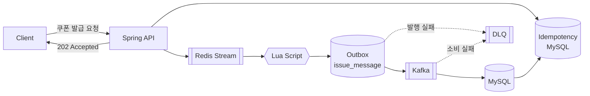

# petcoupon-backend

> **선착순 쿠폰 발급 시스템**
> 대규모 동시 요청 상황에서도 **초과 발급 0건**과 **1인 1매**를 보장하는 쿠폰 발급 백엔드입니다.

**Language · Framework**


**Data · Messaging**


**Build · Infrastructure**


**Test · Quality**


---

## 프로젝트 소개

PetCoupon은 이벤트에 연결된 한정 수량 쿠폰을 선착순으로 발급하는 시스템입니다.
단순히 DB 재고를 차감하는 방식이 아니라,

* Redis를 이용한 실시간 요청 처리
* Lua Script를 통한 원자적 재고 선점
* Redis Stream 기반 요청 대기열
* Outbox Pattern을 통한 메시지 유실 방지
* Kafka 기반 비동기 발급 확정
* Idempotency-Key를 통한 중복 요청 방지
* DB Unique Constraint를 통한 최종 정합성 보장
* Retry / DLQ를 통한 장애 복구

를 조합하여 높은 동시성 환경에서도 발급 정합성을 유지하도록 설계했습니다.

발급 파이프라인 외에 운영을 위한 기능도 함께 제공합니다.

* Spring Batch 기반 발급 정합성 검증 배치
* 관리자 대시보드 요약 및 발급 처리량 통계
* SSE 기반 WARN/ERROR 실시간 모니터링 스트림
* 인프라 컴포넌트 헬스 체크 및 개인정보 마스킹

---

## 핵심 목표

시스템이 반드시 보장해야 하는 조건은 다음과 같습니다.

1. 발급 수량이 쿠폰 전체 수량을 초과하지 않는다.
2. 동일한 사용자는 하나의 쿠폰을 중복 발급받을 수 없다.
3. 같은 요청이 재전송되더라도 한 번만 처리한다.
4. Kafka 메시지가 중복 전달되더라도 DB에는 한 번만 반영한다.
5. 일시적인 장애가 발생하더라도 발급 요청이 유실되지 않는다.
6. 자동 복구가 불가능한 메시지는 DLQ를 통해 수동 재처리할 수 있다.

---

## 시스템 아키텍처

쿠폰 발급은 요청을 **접수하는 단계**와 실제 발급을 **확정하는 단계**로 분리되어 있습니다.



### 발급 흐름

```text
POST /coupons/{couponId}/issues
        ↓
Idempotency-Key 검증
        ↓
Redis Stream 요청 적재
        ↓
202 Accepted
        ↓
Stream Consumer
        ↓
Lua Script
재고 차감 + 순번 채번 + 중복 신청 확인
        ↓
Outbox 저장
        ↓
Kafka 발행
        ↓
Kafka Consumer
        ↓
coupon_issue
coupon_stock
coupon_issue_history
        ↓
발급 확정
```

Redis는 실시간 요청 처리와 재고 선점을 담당하고, MySQL은 최종 발급 결과와 정합성을 보장합니다.
상세 설계는 [`docs/architecture.md`](docs/architecture.md)를 참고합니다.

---

## 기술 스택

| 영역             | 기술                   |
| -------------- | -------------------- |
| Language       | Java 21              |
| Framework      | Spring Boot 4.1.0    |
| Database       | MySQL 8.0            |
| Cache / Queue  | Redis 7.2            |
| Message Broker | Kafka 3.7            |
| ORM            | Spring Data JPA      |
| Batch          | Spring Batch         |
| Build          | Gradle               |
| Monitoring     | Spring Boot Actuator, SSE |
| Test           | JUnit 5, Testcontainers, Awaitility |
| Load Test      | k6                   |
| Infrastructure | Docker Compose       |

---

## Quick Start

### 1. 의존 서비스 실행

Kafka는 Docker Compose의 별도 프로파일로 구성되어 있습니다.

```bash
docker compose --profile kafka up -d
```

### 2. 애플리케이션 실행

```bash
./gradlew bootRun
```

### 3. Health Check

```bash
curl -s localhost:8080/actuator/health
```

정상 실행되면 애플리케이션의 health 상태를 확인할 수 있습니다.

### 부하 테스트용 사용자 데이터

100만 명의 테스트 사용자가 필요한 경우 다음과 같이 시드 데이터를 넣을 수 있습니다.

```bash
docker cp load-test/sql/seed_users.sql petcoupon-mysql:/tmp/
docker exec petcoupon-mysql \
  mysql -uroot -proot petcoupon \
  -e "source /tmp/seed_users.sql"
```

---

## 주요 API

모든 API 응답은 공통 `CustomResponse` 형식을 사용합니다.

```json
{
  "isSuccess": true,
  "code": "200",
  "message": "OK",
  "result": {}
}
```

에러 코드는 `{DOMAIN}{HTTP_STATUS}-{순번}` 규칙을 따릅니다. (`COUPON409-0`, `EVENT404-0`)

목록 API의 페이징 파라미터는 공통 규칙을 따릅니다.

| 파라미터   | 기본값 | 허용 값                      |
| ------ | --- | ------------------------- |
| `page` | `0` | 0 이상 (공개 이벤트 목록은 10,000까지) |
| `size` | `20` | `10` · `20` · `50` · `100` |

허용 범위를 벗어나면 도메인별 에러 코드로 응답합니다. (`COUPON400-11`, `EVENT400-3`)

### 사용자 API

| Method | Endpoint                                       | 설명             |
| ------ | ---------------------------------------------- | -------------- |
| `GET`  | `/events`                                      | 진행 중인 이벤트 목록 (`page`, `size`) |
| `GET`  | `/events/{eventId}`                            | 이벤트 상세 및 쿠폰 목록 |
| `POST` | `/coupons/{couponId}/issues`                   | 쿠폰 선착순 발급 신청   |
| `GET`  | `/coupons/{couponId}/status`                   | 쿠폰 실시간 발급 현황   |
| `GET`  | `/users/{userId}/coupon-issue-requests/status?idempotencyKey={key}` | 발급 신청 처리 결과 폴링 (`idempotencyKey` **필수**) |
| `GET`  | `/users/{userId}/coupon-issue-requests`        | 사용자의 발급 신청 내역 (`status` 필터, 미지정 시 전체) |
| `GET`  | `/coupon-issues/{couponIssueId}`               | 발급 쿠폰 상세 조회    |
| `GET`  | `/coupon-issues/{couponIssueId}/status`        | 발급 쿠폰 상태 조회    |
| `POST` | `/coupon-issues/{couponIssueId}/use`           | 쿠폰 사용          |
| `POST` | `/coupon-issues/{couponIssueId}/cancel`        | 쿠폰 사용 취소       |

쿠폰 발급 요청에는 `Idempotency-Key` 헤더가 필요합니다.

### 관리자 API

`/admin/**` 요청은 `X-ADMIN-KEY` 헤더를 통한 관리자 세션 인증이 필요합니다.
세션 발급(`POST /admin/auth/sessions`)만 예외적으로 토큰 없이 호출할 수 있습니다.

**인증**

| Method   | Endpoint               | 설명                     |
| -------- | ---------------------- | ---------------------- |
| `POST`   | `/admin/auth/sessions` | 관리자 세션 발급 (**토큰 불필요**) |
| `DELETE` | `/admin/auth/sessions` | 관리자 세션 폐기              |

**이벤트 · 쿠폰 관리**

| Method  | Endpoint                                     | 설명                     |
| ------- | -------------------------------------------- | ---------------------- |
| `GET`   | `/admin/events`                              | 전체 이벤트 목록 (`page`, `size`) |
| `POST`  | `/admin/events`                              | 이벤트 생성                 |
| `GET`   | `/admin/events/{eventId}`                    | 이벤트 상세                 |
| `GET`   | `/admin/events/{eventId}/status`             | 이벤트 상태 조회              |
| `PATCH` | `/admin/events/{eventId}`                    | 이벤트 수정                 |
| `PATCH` | `/admin/events/{eventId}/status`             | 이벤트 상태 변경              |
| `POST`  | `/admin/events/{eventId}/coupons`            | 쿠폰 생성                  |
| `PATCH` | `/admin/events/{eventId}/coupons/{couponId}` | 쿠폰 수정 (발급 시작 전에만)      |
| `GET`   | `/admin/coupons`                             | 쿠폰 목록 및 필터링 (`eventId`, `status`, `page`, `size`) |
| `GET`   | `/admin/coupons/{couponId}/status`           | 쿠폰 실시간 현황              |
| `POST`  | `/admin/coupons/expire`                      | 만료 쿠폰 배치 수동 실행         |

**운영 · 장애 대응**

| Method | Endpoint                                        | 설명                       |
| ------ | ----------------------------------------------- | ------------------------ |
| `GET`  | `/admin/coupon-issue/dlq`                       | DLQ 메시지 목록 (`page`, `size`) |
| `POST` | `/admin/coupon-issue/dlq/{messageId}/reprocess` | DLQ 메시지 재처리              |
| `POST` | `/admin/coupon-issue/dlq/{messageId}/abandon`   | DLQ 메시지 폐기               |
| `POST` | `/admin/coupons/{couponId}/reconcile`           | 쿠폰 정합성 검증 배치 실행          |
| `GET`  | `/admin/coupons/{couponId}/reconciliation-reports` | 정합성 검증 이력 (`limit`, 1~100) |

**모니터링 · 통계**

| Method  | Endpoint                        | 설명                                  |
| ------- | ------------------------------- | ----------------------------------- |
| `GET`   | `/admin/dashboard/summary`      | 대시보드 요약 (이벤트·쿠폰·발급 현황)              |
| `GET`   | `/admin/coupon-issue/statistics` | 발급 처리량 추이(최근 24시간)와 메시지 상태 분포       |
| `GET`   | `/admin/system/health`          | 인프라 컴포넌트 상태                         |
| `GET`   | `/admin/monitoring/stream`      | WARN/ERROR 실시간 스트림 (SSE)            |
| `GET`   | `/admin/monitoring/settings`    | 모니터링 스트림 ON/OFF 조회                  |
| `PATCH` | `/admin/monitoring/settings`    | 모니터링 스트림 ON/OFF 변경                  |

`/admin/monitoring/stream`은 `X-ADMIN-KEY` 헤더가 필요하므로 브라우저 네이티브 `EventSource`로는 호출할 수 없습니다.
`@microsoft/fetch-event-source` 같은 fetch 기반 SSE 클라이언트를 사용해야 합니다.

관리자 인증에 대한 상세 내용은 [`docs/development.md`](docs/development.md)를 참고합니다.

### 내부 API

부하 테스트 전용이며 `prod` 프로파일에서는 비활성화됩니다. 관리자 인증 대상이 아닙니다.

| Method | Endpoint                             | 설명                                   |
| ------ | ------------------------------------ | ------------------------------------ |
| `POST` | `/internal/coupons/{couponId}/reset` | 부하 테스트 회차 초기화 (DB 발급 데이터 삭제 + Redis 재설정) |

---

## 동시성과 정합성

쿠폰 발급 과정에서는 하나의 기술에만 의존하지 않고 여러 계층에서 중복으로 정합성을 방어합니다.

| 장치                     | 역할                      |
| ---------------------- | ----------------------- |
| Redis Lua Script       | 재고 확인과 차감을 원자적으로 수행     |
| `uk_issue_coupon_user` | 동일 사용자의 중복 발급 방지        |
| `uk_issue_sequence`    | 쿠폰별 발급 순번 중복 방지         |
| `request_id` Unique    | Kafka 재전달에 따른 중복 저장 방지  |
| `idempotency_key`      | 동일 API 요청의 중복 처리 방지     |
| Conditional UPDATE     | 사용·취소·만료 동시 요청 제어       |
| Pessimistic Lock       | 관리자 수정과 발급·스케줄러 간 경합 제어 |

상세한 동시성 및 정합성 설계는 [`docs/architecture.md`](docs/architecture.md)를 참고합니다.

---

## 배치 및 스케줄러

| 작업                        | 실행 주기    | 역할                            |
| ------------------------- | -------- | ----------------------------- |
| Outbox Publisher          | 1초       | 미발행 메시지를 Kafka로 전달            |
| Stream Pending Recovery   | 5초       | 처리되지 않은 Redis Stream 메시지 회수·재처리 |
| Coupon Status Scheduler   | 60초      | 쿠폰 상태 자동 전이                   |
| Event Status Scheduler    | 1분       | 이벤트 상태 자동 전이                  |
| Reconciliation Scheduler  | 30분      | `ENDED` 쿠폰 발급 정합성 자동 검증       |
| Coupon Expiration         | 매일 01:00 | 만료 쿠폰 처리                      |
| Idempotency Cleanup       | 매일 04:00 | 만료된 멱등성 데이터 정리                |

각 스케줄러는 전용 스레드 풀을 사용하며, 환경변수로 개별 비활성화할 수 있습니다.
정합성 검증 스케줄러는 `ENDED` 쿠폰 전체를 순회하므로 부하 테스트 중에는 끄는 것을 권장합니다.

쿠폰 상태는 다음 흐름을 가집니다.

```text
READY
  ↓
ACTIVE
  ↓
SOLD_OUT
  ↓
ENDED
```

상황에 따라 `ACTIVE → ENDED` 전이도 가능합니다.

---

## 주요 설정

모든 설정은 환경변수로 덮어쓸 수 있으며, 기본값은 로컬에서 바로 실행되도록 구성되어 있습니다.

| 환경변수                              | 기본값               | 설명                    |
| --------------------------------- | ----------------- | --------------------- |
| `DB_URL` `DB_USERNAME` `DB_PASSWORD` | localhost:3306 · root · root | MySQL 접속       |
| `REDIS_HOST` `REDIS_PORT`         | localhost · 6379  | Redis 접속              |
| `KAFKA_BOOTSTRAP_SERVERS`         | localhost:9092    | Kafka 브로커             |
| `ADMIN_AUTH_CODE`                 | 개발용 기본값           | 관리자 세션 발급 코드. **배포 전 반드시 변경** |
| `ADMIN_SESSION_TTL`               | `PT8H`            | 세션 토큰 유효 기간 (ISO-8601 Duration) |
| `JPA_DDL_AUTO`                    | `update`          | 스키마 자동 반영             |
| `DB_POOL_SIZE`                    | 10                | HikariCP 풀 크기. 워커 스레드와 함께 조정 |
| `TOMCAT_MAX_THREADS`              | 200               | 워커 스레드 상한             |
| `ACTUATOR_ENDPOINTS`              | `health,info,metrics` | 노출할 Actuator 엔드포인트 |
| `ISSUE_LOG_LEVEL`                 | `INFO`            | 발급 파이프라인 로그 레벨        |
| `COUPON_RECONCILIATION_SCHEDULER_ENABLED` | `true`    | 정합성 검증 자동 스케줄러 on/off |
| `EVENT_STATUS_SCHEDULER_ENABLED`  | `true`            | 이벤트 상태 전이 스케줄러 on/off |
| `COUPON_STATUS_SCHEDULER_ENABLED` | `true`            | 쿠폰 상태 전이 스케줄러 on/off  |
| `CORS_ALLOWED_ORIGINS`            | localhost 3000·5173 | 허용할 프론트엔드 오리진       |

Redis Stream, Outbox 재시도, SSE 버퍼 등 세부 튜닝 값은
[`src/main/resources/application.properties`](src/main/resources/application.properties)와
[`docs/development.md`](docs/development.md)를 참고합니다.

### 메시지 채널

| 구분           | 이름                          |
| ------------ | --------------------------- |
| Redis Stream | `coupon:issue:stream`       |
| Stream DLQ   | `coupon:issue:stream:dlq`   |
| Kafka Topic  | `coupon-issue-events`       |
| Kafka DLQ    | `coupon-issue-events-dlq`   |

---

## 프로젝트 구조

```text
src/main/java/com/mycom/petcoupon/
├── coupon/
│   ├── issue/
│   │   ├── config/
│   │   ├── producer/
│   │   ├── consumer/
│   │   └── service/
│   │
│   ├── controller/
│   ├── service/
│   ├── repository/
│   ├── entity/
│   ├── dto/
│   └── converter/
│
├── event/
├── idempotency/
├── messaging/
├── reconciliation/
├── notification/
├── dashboard/
├── monitoring/
├── system/
├── internal/
├── user/
│
└── global/
    ├── auth/
    ├── common/
    └── config/
```

주요 역할은 다음과 같습니다.

| Package          | 역할                          |
| ---------------- | --------------------------- |
| `coupon`         | 쿠폰 관리 및 상태                  |
| `coupon.issue`   | 선착순 쿠폰 발급 파이프라인             |
| `event`          | 이벤트 관리                      |
| `idempotency`    | API 요청 멱등성                  |
| `messaging`      | Outbox 메시지                  |
| `reconciliation` | 쿠폰 발급 정합성 검증 (Spring Batch) |
| `notification`   | 알림                          |
| `dashboard`      | 관리자 대시보드 요약 집계              |
| `monitoring`     | WARN/ERROR 실시간 SSE 스트림      |
| `system`         | 인프라 컴포넌트 헬스 체크              |
| `internal`       | 부하 테스트 전용 API (`prod` 비활성)  |
| `user`           | 사용자                         |
| `global`         | 공통 응답, 예외, 설정 및 관리자 인증      |

계층은 `controller → service / serviceImpl → repository` 순으로 의존하며,
Entity ↔ DTO 변환은 `converter`가 전담합니다.

---

## 테스트

전체 테스트는 다음 명령으로 실행합니다.

```bash
./gradlew test
```

통합 테스트는 MySQL, Redis, Kafka를 사용하므로 테스트 실행 전에 의존 서비스를 실행해야 합니다.

```bash
docker compose --profile kafka up -d
```

새로운 `@SpringBootTest`를 작성할 때는 백그라운드 스케줄러가 다른 테스트 데이터를 변경하지 않도록 필요한 경우 스케줄러를 비활성화합니다.

```java
@SpringBootTest(properties = {
    "event.status.scheduler.enabled=false",
    "coupon.status.enabled=false"
})
```

테스트 작성 및 개발 규칙은 [`docs/development.md`](docs/development.md)를 참고합니다.

---

## Load Test

부하 테스트 관련 코드와 실행 스크립트는 `load-test/`에서 관리합니다.

```text
load-test/
├── README.md
├── docs/
│   ├── load-test-scenario.md
│   ├── integration-test-scenario.md
│   └── integration-test-result.md
├── k6/
├── scripts/
└── sql/
```

자세한 실행 방법은 [`load-test/README.md`](load-test/README.md)를 참고합니다.

---

## 개발 문서

README는 프로젝트 전체를 빠르게 파악하기 위한 입구 역할만 담당합니다.
상세 내용은 목적에 따라 다음 문서를 참고합니다.

| 문서                                                   | 내용                                |
| ---------------------------------------------------- | --------------------------------- |
| [`docs/architecture.md`](docs/architecture.md)       | 시스템 아키텍처, 쿠폰 발급 파이프라인, 동시성·정합성 설계 |
| [`docs/development.md`](docs/development.md)         | 개발 환경, 설정, 테스트, 코딩 컨벤션, 협업 규칙     |
| [`docs/contributors.md`](docs/contributors.md)       | 팀원별 담당 영역과 주요 구현 내용               |
| [`docs/troubleshooting.md`](docs/troubleshooting.md) | 실행·운영 중 발생할 수 있는 문제와 해결 방법        |
| [`load-test/README.md`](load-test/README.md)         | 부하 테스트 환경과 실행 방법                  |

---

## Documentation Map

```text
README.md
   │
   ├── docs/
   │   ├── architecture.md
   │   ├── development.md
   │   ├── contributors.md
   │   └── troubleshooting.md
   │
   └── load-test/
       ├── README.md
       ├── docs/
       ├── k6/
       ├── scripts/
       └── sql/
```

README에서 전체 프로젝트를 파악한 뒤, 필요한 주제만 상세 문서에서 확인하는 것을 기준으로 합니다.

---

## Team

| 담당 영역      | 주요 역할                                 |
| ---------- | ------------------------------------- |
| 이벤트·쿠폰 관리  | 이벤트 생성·수정, 쿠폰 생성·재고 관리, 오픈 제어, 관리자 현황 |
| 선착순 신청·멱등성 | 쿠폰 신청 처리, 트랜잭션, Idempotency           |
| Redis·동시성  | Redis, Lua Script, 동시성 제어             |
| Kafka·비동기  | Kafka 기반 비동기 발급 처리                    |
| 쿠폰 상태·정합성  | 사용·취소·만료·이력·정합성 검증                    |
| 성능·인프라     | 대량 데이터, 부하 테스트, Docker, 모니터링          |

개인별 상세 기여 내용은 [`docs/contributors.md`](docs/contributors.md)를 참고합니다.
