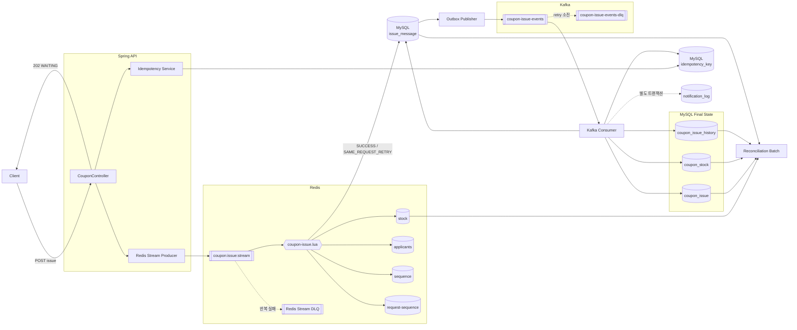
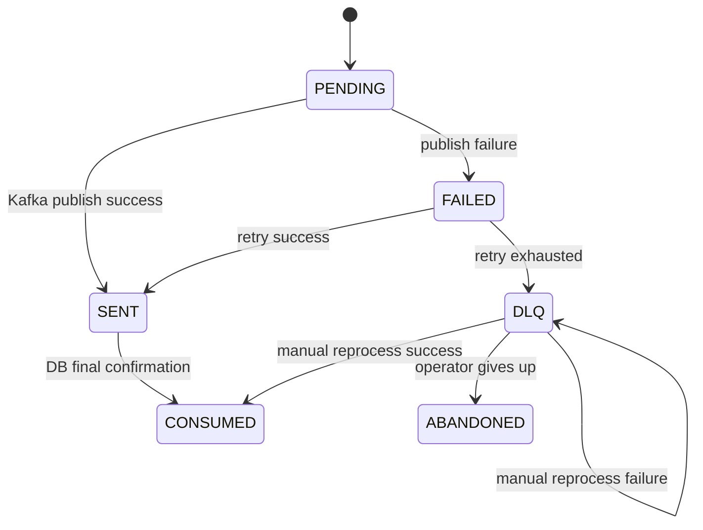
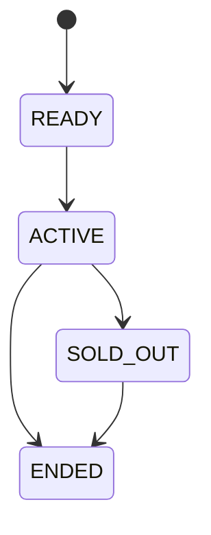
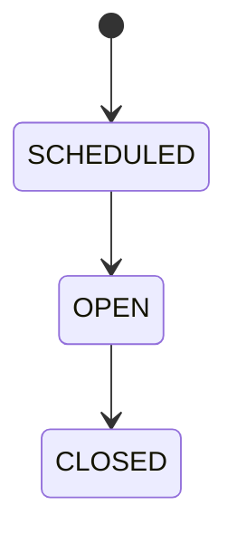
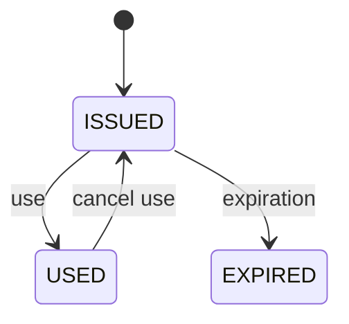

# 시스템 아키텍처

> 이 문서는 PetCoupon 백엔드의 현재 구현을 기준으로 **왜 이러한 구조를 선택했는지**, 각 컴포넌트가 어떤 책임과 정합성 경계를 가지는지, 장애가 발생했을 때 어떤 방식으로 복구하는지를 설명합니다.
>
> API 목록과 실행 방법은 루트 [`README.md`](../README.md), 개발 규칙과 코드 작성 방법은 [`development.md`](development.md), 장애 진단은 [`troubleshooting.md`](troubleshooting.md)를 참고합니다.

---

## 먼저 알아야 할 세 가지 경계

이 문서 전체를 관통하는 가장 중요한 구분입니다. 이것만 알아도 대부분의 "버그처럼 보이는 정상 동작"을 판별할 수 있습니다.

> **HTTP 202는 발급 완료가 아니라 요청 접수 성공입니다.**
>
> **Redis Lua의 `SUCCESS`는 발급 완료가 아니라 재고 선점 성공입니다.**
>
> **MySQL에 `coupon_issue`가 저장되고 `issue_message`가 `CONSUMED`가 된 시점이 최종 발급 확정입니다.**

여기서 파생되는 결과가 두 개 더 있습니다.

| 개념 | 의미 | 저장소 |
|---|---|---|
| **Redis 재고** | 요청 처리 시점의 **선점 가능한** 재고 | Redis |
| **DB 재고** | Kafka Consumer를 거쳐 **최종 확정된** 발급 재고 | MySQL `coupon_stock` |

처리 중에 두 값이 다른 것은 **오류가 아니라 정상**입니다. 자세한 내용은 [20. Redis와 DB의 재고는 같은 의미가 아니다](#20-redis와-db의-재고는-같은-의미가-아니다)를 참고합니다.

---

## 목차

| 알고 싶은 것 | 항목 |
|---|---|
| 이 구조를 왜 골랐는가 | [1. 설계 목표](#1-설계-목표) · [2. 핵심 아키텍처](#2-핵심-아키텍처) |
| 요청이 어떻게 흘러가는가 | [3. End-to-End 발급 흐름](#3-end-to-end-발급-흐름) |
| Redis는 무엇을 하는가 | [4. Redis가 담당하는 선착순 경쟁](#4-redis가-담당하는-선착순-경쟁) ~ [7. Redis Consumer 장애 복구](#7-redis-consumer-자체의-장애-복구) |
| Outbox는 왜 있는가 | [8. Redis와 Kafka 사이의 Outbox](#8-redis와-kafka-사이의-outbox) ~ [10. Kafka 파티션과 순서](#10-kafka-파티션과-순서) |
| DB는 무엇을 보장하는가 | [11. Kafka Consumer와 최종 DB 확정](#11-kafka-consumer와-최종-db-확정) ~ [16. 알림 분리](#16-알림은-발급-트랜잭션과-분리한다) |
| 실패하면 어떻게 되는가 | [17. Kafka Retry와 DLQ](#17-kafka-retry와-dlq) ~ [19. abandon과 재고 복구](#19-dlq-abandon과-redis-재고-복구) |
| 상태가 왜 늦게 바뀌는가 | [20. 두 종류의 재고](#20-redis와-db의-재고는-같은-의미가-아니다) ~ [24. 발급 쿠폰 상태 전이](#24-발급-쿠폰-상태-전이) |
| 검증과 정합성 | [25. Background Job](#25-background-job의-책임-분리) ~ [29. Reconciliation 실행 조건](#29-reconciliation-실행-조건) |
| **계약과 한계** | [30. 트랜잭션 경계 요약](#30-트랜잭션-경계-요약) · [31. 장애 시나리오](#31-장애-시나리오별-동작) · [33. Trade-off와 한계](#33-설계-trade-off와-알려진-한계) |
| 코드 위치 | [35. Architecture Code Map](#35-architecture-code-map) |

---

## 1. 설계 목표

PetCoupon의 핵심 문제는 단순한 쿠폰 CRUD가 아니라 **한정된 재고에 대량의 동시 요청이 들어오는 선착순 발급**입니다.

시스템은 다음 조건을 우선적으로 보장하도록 설계되어 있습니다.

1. 발급 수량이 쿠폰의 전체 수량을 초과하지 않습니다.
2. 동일 사용자는 동일 쿠폰을 두 번 발급받지 않습니다.
3. 동일한 API 요청이 재전송되어도 본처리는 한 번만 수행합니다.
4. Redis Stream 또는 Kafka에서 메시지가 재전달되어도 최종 DB 결과는 중복 생성되지 않습니다.
5. 일시적인 장애가 발생했을 때 처리 중인 요청을 가능한 한 유실하지 않습니다.
6. 자동 복구가 어려운 실패는 DLQ와 관리자 조치를 통해 추적 가능하게 남깁니다.
7. Redis의 실시간 선점 상태와 MySQL의 최종 확정 상태가 어긋날 가능성을 인정하고, 별도의 정합성 검증 경로를 둡니다.

**이 시스템은 하나의 기술로 모든 정합성을 해결하지 않습니다.**

```text
API Idempotency
    +
Redis Lua atomic operation
    +
Redis Stream Pending recovery
    +
Outbox durable staging
    +
Kafka retry / redelivery
    +
DB Unique Constraint
    +
Conditional UPDATE
    +
Reconciliation Batch
```

각 계층이 서로 다른 실패 모드를 방어합니다.

---

## 2. 핵심 아키텍처

쿠폰 발급은 크게 두 단계로 나뉩니다.

- **접수 및 선점 단계** — 요청을 빠르게 받아 Redis에서 선착순 재고를 결정합니다.
- **최종 확정 단계** — 선점 결과를 Kafka를 통해 MySQL에 영구 반영합니다.



---

## 3. End-to-End 발급 흐름

### 3.1 요청 사전 검증

사용자는 다음 API로 발급을 신청합니다.

```http
POST /coupons/{couponId}/issues
Idempotency-Key: ...
```

컨트롤러는 비동기 파이프라인에 요청을 넣기 전에 다음을 확인합니다.

- 쿠폰 존재 여부
- 쿠폰 발급 가능 기간
- 사용자 존재 여부
- `Idempotency-Key`

발급 가능 기간 검증을 **멱등키 등록보다 먼저** 수행하는 이유는 명확합니다.

오픈 전 요청처럼 애초에 파이프라인에 들어가면 안 되는 요청이 먼저 `idempotency_key`에 등록되면, 잘못된 요청이 `IN_PROGRESS` 또는 실패 이력으로 남아 이후 정상적인 재시도를 방해할 수 있습니다.

따라서 **명백하게 거절할 수 있는 요청은 비동기 경계 전에 Fail-Fast**합니다.

### 3.2 API 멱등성 레코드 선점

API 멱등성은 MySQL의 `idempotency_key` 테이블로 관리합니다.

```text
처음 보는 Idempotency-Key
        ↓
INSERT 시도
        ↓
IN_PROGRESS
        ↓
본처리 진행

동일 키 재요청
        ↓
기존 레코드 상태 확인
        ├─ 처리 완료 → 저장된 응답 재현
        ├─ 아직 처리 중 → 409
        ├─ 만료된 시도 → reclaim 후 재처리
        └─ 다른 요청에 키 재사용 → 409
```

동시 요청에서 `SELECT → INSERT`를 사용하지 않고 **먼저 INSERT를 시도한 뒤 DB Unique Constraint로 승자를 결정**합니다. 두 요청이 동시에 "키가 없다"고 판단한 뒤 둘 다 INSERT하는 check-then-act race를 DB에서 차단하기 위함입니다.

같은 키가 다른 요청에 재사용되는 것을 막기 위해 `(couponId, userId)`를 기반으로 `request_hash`도 저장합니다.

#### MySQL과 Redis는 하나의 트랜잭션이 아니다

`idempotency_key`는 MySQL에 있고 이후 요청 대기열은 Redis에 있습니다.

```text
MySQL idempotency begin
        ↓
Redis Stream publish
```

두 작업은 하나의 ACID 트랜잭션으로 묶을 수 없습니다. 그래서 `begin()`을 먼저 별도 트랜잭션으로 커밋합니다. Redis 접근 중 애플리케이션이 죽더라도 `IN_PROGRESS` 기록이 DB에 남아 있어야 `expires_at`을 기준으로 죽은 요청을 다시 가져갈 수 있기 때문입니다.

현재 `IN_PROGRESS` TTL 기본값은 **600초**이며, 완료된 멱등성 레코드는 응답 재현을 위해 더 오래 보관한 뒤 정리합니다.

### 3.3 내부 requestId

초기 구현에서는 클라이언트의 `Idempotency-Key` 자체를 Stream `requestId`로 사용했지만 현재 구조는 다릅니다.

```text
issue:{idempotencyRecordId}
```

클라이언트 멱등키의 유일성 범위와 파이프라인 내부 식별자의 유일성 범위가 다르기 때문입니다. 다음 영역은 시스템 전체에서 중복되지 않는 requestId가 필요합니다.

- Redis request-sequence
- Outbox `message_key`
- Kafka 이벤트
- `coupon_issue.request_id`

DB에서 발급한 idempotency record ID를 내부 requestId로 변환하여 전역 식별자로 사용합니다.

### 3.4 Redis Stream 적재와 202 응답

사전 검증과 멱등성 판단을 통과하면 API는 쿠폰을 즉시 발급하지 않습니다. Stream key `coupon:issue:stream`에 다음 정보를 적재합니다.

```text
requestId
couponId
userId
```

적재가 성공하면 클라이언트에는 `202 Accepted`, `status=WAITING`을 반환합니다.

이 응답은 **요청이 비동기 발급 파이프라인에 정상적으로 접수되었다**는 것만 보장합니다. 재고 확보, 발급 순번 확정, `coupon_issue` 생성, 최종 성공은 아직 보장하지 않습니다. 최종 결과는 별도의 상태 조회 API에서 확인합니다.

---

## 4. Redis가 담당하는 선착순 경쟁

### 4.1 Redis의 역할

Redis는 이 시스템에서 단순 캐시가 아니라 **실시간 경쟁 상태를 결정하는 선착순 게이트**입니다.

| 역할 | Key |
|---|---|
| 잔여 재고 | `coupon:issue:stock:{couponId}` |
| 사용자별 최초 요청 | `coupon:issue:applicants:{couponId}` |
| 전역 발급 순번 | `coupon:issue:sequence:{couponId}` |
| 요청별 발급 순번 | `coupon:issue:request-sequence:{couponId}` |

`{couponId}` hash tag를 사용해 같은 쿠폰의 다중 key가 Redis Cluster에서도 같은 hash slot에 위치하도록 합니다.

### 4.2 왜 Lua Script인가

선착순 발급에서 아래 로직을 애플리케이션 명령 여러 개로 분리하면 race condition이 생깁니다.

```text
중복 사용자인가?
재고가 남았는가?
순번을 몇 번으로 줄 것인가?
재고를 감소시킵니다.
신청자를 기록합니다.
요청과 순번을 연결합니다.
```

PetCoupon은 이 전체 판단을 하나의 Lua Script에서 실행합니다.

```text
사용자 중복 확인
    ↓
재고 존재 여부 확인
    ↓
재고 > 0 확인
    ↓
INCR sequence
    ↓
DECR stock
    ↓
HSET applicants
    ↓
HSET request-sequence
```

Redis는 Lua Script를 원자적으로 실행하므로 **재고 확인과 차감 사이에 다른 요청이 끼어드는 race를 제거**합니다.

### 4.3 Lua 결과 계약

| 결과 | 의미 | 후속 처리 |
|---|---|---|
| `SUCCESS` | 최초 요청이 재고 선점 성공 | Outbox 저장 |
| `SAME_REQUEST_RETRY` | 동일 requestId가 다시 실행됨 | 기존 sequence로 Outbox 멱등 저장 |
| `ALREADY_APPLIED` | 같은 사용자의 다른 요청이 이미 존재 | 최종 실패 확정 후 Stream ACK |
| `SOLD_OUT` | 잔여 재고가 없음 | 최종 실패 확정 후 Stream ACK |
| `STOCK_NOT_INITIALIZED` | 재고 key가 존재하지 않음 | 상태 이상으로 보고 Pending |
| `SEQUENCE_NOT_FOUND` | 신청 기록은 있으나 순번 기록이 없음 | Redis 정합성 이상으로 보고 Pending |

`SAME_REQUEST_RETRY` 덕분에 Stream 메시지가 재전달되어 Lua가 다시 실행되어도 **재고를 다시 차감하지 않고 최초에 부여한 sequenceNo를 그대로 반환**합니다.

### 4.4 선착순 순번의 의미

`sequenceNo`는 Lua에서 실제 재고 선점이 성공하는 순간 `INCR`로 부여합니다.

따라서 이 시스템의 선착순 순서는 정확히 말하면 **Redis의 원자적 선점 연산이 성공한 순서**입니다.

HTTP 패킷이 서버에 도착한 절대적인 물리 순서를 계약으로 보장하지 않습니다. Stream Consumer가 병렬로 동작할 수 있고 스케줄링 차이가 존재하기 때문입니다.

**한 번 부여된 순번은 이후 단계에서 바뀌지 않습니다.**

---

## 5. Redis Stream의 전달 보장

Redis Stream Consumer의 기본 원칙은 다음과 같습니다.

> **안전하게 다음 단계로 넘겼다고 확인된 메시지만 ACK합니다.**

`SUCCESS` 또는 `SAME_REQUEST_RETRY`인 경우:

```text
Lua 성공
   ↓
Outbox saveIfAbsent
   ↓
Outbox가 새로 저장되었거나 이미 존재함 확인
   ↓
Stream ACK
```

ACK 기준은 Kafka 발행 성공이 아니라 **MySQL Outbox에 다음 처리 정보가 durable하게 존재하는가**입니다.

`ALREADY_APPLIED`, `SOLD_OUT`은 재시도해도 결과가 달라지지 않는 최종 비즈니스 실패이므로 결과를 확정하고 ACK합니다.

반대로 Redis 상태 이상, Lua 결과 이상, Outbox 저장 실패, 기타 처리 예외에서는 **ACK하지 않습니다.** 해당 메시지는 Pending Entries List에 남습니다.

---

## 6. Pending Recovery와 Redis Stream DLQ

Consumer가 죽거나 메시지 처리가 중간에 실패하면 Pending 메시지를 다시 가져와야 합니다.

```text
XPENDING
   ↓
최소 idle time 초과 메시지 조회
   ↓
XCLAIM
   ↓
소유권 확보
   ↓
기존 Stream Consumer 처리 로직 재사용
```

재처리 횟수가 최대 횟수를 초과하면 **Redis Stream 전용 DLQ**로 이동합니다.

```text
Pending retry exhausted
        ↓
Redis Stream DLQ 저장
        ↓
DLQ 저장 성공 확인
        ↓
원본 Stream ACK
```

원본을 먼저 ACK한 후 DLQ 저장이 실패하면 메시지가 유실될 수 있기 때문에 **DLQ 저장을 먼저** 합니다.

반대로 DLQ 저장 후 ACK가 실패하면 DLQ 중복 가능성은 생길 수 있습니다. 이 경계에서는 **중복 가능성보다 유실 방지**를 우선합니다.

> Redis Stream DLQ(`coupon:issue:stream:dlq`)와 Kafka DLQ(`issue_message.status = DLQ`)는 **서로 다른 실패 단계의 큐**입니다. 관리자 API `GET /admin/coupon-issue/dlq`가 조회하는 것은 후자입니다.

---

## 7. Redis Consumer 자체의 장애 복구

Redis read request 자체가 끊어지면 Consumer Container를 재시작합니다.

```text
Redis read error
    ↓
기존 read request 취소
    ↓
Container restart
    ↓
실패하면 exponential backoff
1s → 2s → 4s → ... → max 30s
```

`container.start()` 호출 성공만으로 Redis가 정상 복구됐다고 판단하지 않습니다. **실제 메시지를 다시 정상 소비했을 때** recovery failure count를 초기화합니다.

Consumer Group이 사라진 `NOGROUP` 상황에서는 메시지 유실을 피하기 위해 `0-0`부터 Group을 복구합니다. 이 선택은 과거 메시지 재전달 가능성을 높이므로, 이후 전 구간이 **재전달을 전제로 멱등하게** 설계되어 있습니다.

---

## 8. Redis와 Kafka 사이의 Outbox

### 8.1 Outbox가 필요한 이유

Redis에서 재고 선점이 끝난 직후 Kafka에 바로 발행하면 다음 failure window가 생깁니다.

```text
Redis 재고 차감 성공
        ↓
프로세스 종료
        X
Kafka 발행 안 됨
```

PetCoupon은 Redis 선점 결과를 먼저 MySQL의 `issue_message`에 저장합니다.

```text
Redis Lua
   ↓
issue_message PENDING
   ↓
Stream ACK
   ↓
Outbox Publisher
   ↓
Kafka
```

Redis와 MySQL을 하나의 트랜잭션으로 묶지는 못합니다. 대신 Lua 재실행 멱등성, Stream Pending, Outbox `saveIfAbsent`, DB Unique Constraint로 경계를 보완합니다.

Redis 선점 후 Outbox 저장이 실패하면 Stream을 ACK하지 않습니다. 재처리 시 Lua는 동일 requestId에 기존 순번을 반환하고 Outbox 저장을 다시 시도합니다.

### 8.2 전통적인 Transactional Outbox와의 차이

일반적인 Transactional Outbox는 DB 비즈니스 변경과 Outbox insert를 **동일 DB 트랜잭션**으로 묶습니다.

PetCoupon의 선착순 결정은 Redis에서 먼저 발생합니다. 따라서 여기의 Outbox는 Redis 변경과 같은 트랜잭션에 속하지 않습니다.

정확히는 **Redis 선점 결과와 Kafka 발행 사이에 durable한 DB staging point를 둡니다.** Redis ↔ MySQL 사이의 원자성 부족은 Stream 재전달과 Lua 멱등성으로 보완합니다.

### 8.3 Outbox의 중복 방어

`issue_message`에는 다음 Unique Constraint가 있습니다.

| 제약 | 컬럼 |
|---|---|
| `uk_message_key_topic` | `(topic, message_key)` |
| `uk_message_sequence` | `(coupon_id, sequence_no)` |

같은 requestId가 여러 Consumer에서 동시에 Outbox 저장을 시도해도 **하나만 생성됩니다.**



---

## 9. Outbox Publisher와 Kafka 발행

Outbox Publisher는 `PENDING`, `FAILED` 상태를 주기적으로 읽어 Kafka에 발행합니다.

```text
success → SENT
failure → FAILED
retry exhausted → DLQ
```

Kafka Producer callback에서 DB 상태 갱신도 실패할 수 있으므로 callback 예외를 Future에 다시 전파합니다.

Kafka 발행 자체는 성공했지만 `SENT` 상태 변경이 실패하면 동일 Outbox가 다시 선택되어 Kafka에 **재발행될 가능성**이 있습니다.

이 시스템은 transport 단계의 완벽한 exactly-once에 의존하지 않고, Kafka Consumer가 중복 이벤트를 안전하게 처리하도록 설계합니다.

> **전달 의미는 at-least-once delivery + idempotent application effect에 가깝습니다.**

---

## 10. Kafka 파티션과 순서

Kafka Producer의 message key는 `requestId`가 아니라 **`couponId`**입니다.

Kafka가 보장하는 순서는 파티션 내부 순서뿐입니다. 같은 쿠폰의 이벤트를 같은 파티션으로 보내 Redis에서 부여한 `sequenceNo` 흐름이 Consumer 단계에서도 쿠폰 단위로 유지되도록 합니다.

전체 시스템의 글로벌 순서가 아니라 **쿠폰 단위 ordering**을 유지하는 설계입니다.

---

## 11. Kafka Consumer와 최종 DB 확정

Kafka Consumer가 이벤트를 받으면 최종 발급 상태를 MySQL에 기록합니다. 핵심 트랜잭션은 다음을 하나로 묶습니다.

```text
coupon_issue INSERT
        +
coupon_stock conditional UPDATE
        +
coupon_issue_history INSERT
        +
idempotency final SUCCEEDED
        +
issue_message → CONSUMED
```

**이 중 하나라도 실패하면 발급 확정 트랜잭션 전체가 롤백됩니다.**

### 왜 `CouponIssuePersister`를 별도 Bean으로 두는가

`@Transactional` 메서드를 같은 클래스 내부에서 직접 호출하면 Spring Proxy를 거치지 않아 트랜잭션이 적용되지 않는 **self-invocation** 문제가 생깁니다.

그래서 Kafka listener와 DB persistence 책임을 별도 Bean으로 분리했습니다. 이는 단순 클래스 정리가 아니라 **트랜잭션 경계를 보장하기 위한 구조적 분리**입니다.

---

## 12. DB가 담당하는 최종 방어선

Redis가 선착순 경쟁의 1차 방어선이지만 **MySQL은 Redis 결과를 무조건 신뢰하지 않습니다.**

| 불변식 | DB 방어 |
|---|---|
| 동일 사용자 중복 발급 금지 | `uk_issue_coupon_user (coupon_id, user_id)` |
| 동일 순번 중복 금지 | `uk_issue_sequence (coupon_id, sequence_no)` |
| 동일 request 중복 금지 | `request_id` 컬럼 `UNIQUE` |
| 동일 coupon code 중복 금지 | `coupon_code` 컬럼 `UNIQUE` |

애플리케이션 사전 조회가 race condition으로 뚫려도 최종 DB가 잘못된 상태를 허용하지 않습니다.

---

## 13. DB 재고 갱신

Redis에서 이미 재고 선점 여부가 결정되었더라도 MySQL `coupon_stock`을 안전하게 갱신합니다. 개념적으로 다음 조건부 UPDATE입니다.

```sql
UPDATE coupon_stock
SET
    issued_quantity = issued_quantity + 1,
    remaining_quantity = remaining_quantity - 1
WHERE coupon_id = ?
  AND remaining_quantity > 0;
```

업데이트 row가 0이면 예외를 발생시켜 발급 트랜잭션 전체를 롤백합니다.

이것은 Redis를 대체하는 선착순 판정이 아니라 **DB 최종 불변식 방어**입니다.

또한 JPA bulk UPDATE에서는 `@LastModifiedDate`가 자동 적용되지 않기 때문에 `updated_at`도 쿼리에서 명시적으로 갱신합니다.

---

## 14. Kafka 재전달 처리

Kafka는 Consumer가 DB 처리 후 offset commit 전에 죽거나 리밸런싱되면 같은 이벤트를 다시 전달할 수 있습니다.

Consumer는 먼저 `requestId`로 기존 `coupon_issue`를 확인합니다. 이미 저장되어 있다면 발급을 다시 생성하지 않고 다음 후처리만 다시 확정합니다.

- idempotency 최종 결과
- `issue_message = CONSUMED`

두 Consumer가 동시에 같은 이벤트를 처리해 사전 조회를 둘 다 통과할 수도 있습니다. 이 경우 **최종 Unique Constraint가 승자를 하나로 제한**합니다.

Constraint 또는 concurrency 예외가 발생하면 requestId를 다시 조회하여 다른 Consumer가 정상 저장한 것이 확인되면 멱등 성공으로 처리하고, 실제 다른 데이터 오류라면 Kafka retry/DLQ 경로로 재전파합니다.

---

## 15. Idempotency의 두 단계 의미

비동기 API에서는 하나의 멱등성 레코드가 **접수 응답**과 **최종 결과**를 모두 보관합니다.

API가 Stream 적재에 성공하면 `202 WAITING` 응답을 저장하지만 이는 최종 성공이 아닙니다.

```text
Lua ALREADY_APPLIED / SOLD_OUT
    → final FAILED

Kafka Consumer DB persist success
    → final SUCCEEDED / 200
```

HTTP 요청 스레드의 늦은 `202` 저장이 Consumer가 먼저 확정한 최종 결과를 덮어쓰지 않도록 **조건부 UPDATE**를 사용합니다.

### 현재 상태 모델의 주의점

`idempotency_key.status = SUCCEEDED`만 보고 파이프라인 최종 완료 여부를 판단하면 안 됩니다. 접수 시점의 `202 WAITING`도 저장될 수 있기 때문입니다.

그래서 발급 결과 조회 API는 저장된 응답의 의미까지 확인하여 WAITING과 최종 완료를 구분합니다. **이는 현재 구현의 중요한 semantic caveat입니다.**

---

## 16. 알림은 발급 트랜잭션과 분리한다

최종 발급 후 Mock 알림 로그를 기록하지만, 알림 실패 때문에 정상 발급 전체가 롤백되면 안 됩니다.

```text
[Transaction A]
coupon_issue
coupon_stock
history
idempotency
issue_message CONSUMED
        ↓ COMMIT

[Transaction B]
notification_log
```

알림 기록 실패는 발급을 되돌리지 않습니다. 알림은 발급 consistency boundary 바깥에 있는 **best-effort side effect**입니다.

---

## 17. Kafka Retry와 DLQ

Kafka Consumer 실패는 설정된 retry를 수행하고, 소진되면 Kafka DLQ로 이동합니다. **DLQ는 자동 무한 재처리하지 않습니다.**

```text
DLQ
 ↓
관리자 목록 확인
 ├─ reprocess
 └─ abandon
```

Poison Message가 계속 실패하면서 자원을 소모하거나 동일 오류를 반복하는 것을 피하기 위해 운영자 판단을 명시적으로 둡니다.

---

## 18. 왜 DLQ 진입 시 즉시 재고를 복구하지 않는가

Redis에서 재고를 선점한 이벤트가 Kafka 처리에 실패했다고 바로 재고를 복구하면 위험합니다.

```text
1. Redis stock -1
2. Kafka 처리 실패
3. Redis stock +1 즉시 보상
4. 원래 이벤트가 재처리되어 DB 발급 성공
5. 복구된 재고로 다른 사용자도 추가 발급
```

따라서 **재처리 가능성이 남아 있는 동안 재고는 복구하지 않습니다.**

DLQ 자체는 아직 "발급 실패 최종 확정"이 아닙니다. 운영자가 더 이상 재처리하지 않겠다고 명시적으로 `abandon`했을 때만 Redis 재고 복구를 시도합니다.

---

## 19. DLQ abandon과 Redis 재고 복구

```text
claimForAbandon
(DB CAS)
     ↓
ABANDONED 선점 성공
     ↓
Redis restoreStock Lua
     ↓
stock_restored_at 기록
```

DB claim을 먼저 하는 이유는 reprocess와 abandon이 동시에 들어오는 상황을 막기 위해서입니다. Redis 재고를 먼저 복구한 뒤 다른 요청이 reprocess에 성공하면 **초과 발급 위험**이 생깁니다.

### 재고 복구 Lua

복구 대상의 다음 값이 모두 일치해야 합니다.

- userId
- requestId
- sequenceNo

정상 복구에서는 하나의 Lua Script가 원자적으로 다음을 수행합니다.

```text
HDEL applicants
HDEL request-sequence
INCR stock
```

신청자 기록과 요청 순번 기록이 모두 없다면 **이미 복구된 것**으로 판단해(`ALREADY_RESTORED`) 재고를 다시 증가시키지 않습니다. 따라서 abandon은 같은 messageId로 재호출해도 안전합니다.

### sequence는 복구하지 않는다

재고는 복구하지만 글로벌 `sequence`는 감소시키지 않습니다.

```text
재고 → 복구 가능
선착순 sequence → 재사용하지 않음
```

이미 한 번 발급 과정에서 사용된 순번을 다른 요청에 다시 부여하지 않기 위한 정책입니다.

---

## 20. Redis와 DB의 재고는 같은 의미가 아니다

시스템에는 **의도적으로** 두 종류의 재고 상태가 존재합니다.

| 저장소 | 의미 | 갱신 시점 |
|---|---|---|
| Redis | 실시간 선점 기준 | Lua Script가 즉시 차감 |
| MySQL `coupon_stock` | 최종 발급 확정 기준 | Kafka Consumer가 DB 저장 성공 시 |

따라서 비동기 처리 중 다음 상태가 **정상적으로** 존재할 수 있습니다.

```text
Redis remaining = 90
DB remaining    = 100
```

10건이 Redis에서 선점됐지만 아직 Kafka Consumer가 DB에 확정하지 않았다면 오류가 아닙니다. 발급 파이프라인 처리 중 **eventual consistency**를 허용합니다.

---

## 21. 조회 API의 Source of Truth 선택

### 실시간 발급 현황 → Redis

Redis stock key가 없을 때는 단순 `remaining=0`으로 해석하지 않고 **`initialized=false`를 별도로 제공**해 재고 초기화 전과 실제 품절을 구분합니다.

### 관리자 쿠폰 목록 → MySQL

페이지의 쿠폰마다 Redis를 조회하면 다음 문제가 생깁니다.

- N번의 네트워크 호출
- Redis 장애가 페이지 전체로 전파
- 미초기화 의미 처리

따라서 읽기 모델을 다음처럼 나눕니다.

```text
실시간 운영 현황 → Redis
최종 관리/집계 → MySQL
```

---

## 22. SOLD_OUT 상태와 비동기 지연



`SOLD_OUT` 판정은 Redis의 실시간 stock이 아니라 **DB `coupon_stock.remaining_quantity`를 기준**으로 상태 스케줄러가 수행합니다.

스케줄러 실행 순서는 다음과 같습니다.

```text
READY → ACTIVE
     ↓
ACTIVE → SOLD_OUT
     ↓
ACTIVE/SOLD_OUT → ENDED
```

따라서 Redis 재고가 0이 된 순간과 `Coupon.status=SOLD_OUT`이 되는 순간 사이에는 지연이 존재할 수 있습니다. **현재 60초 주기 상태 스케줄러의 지연을 허용하는 설계입니다.**

---

## 23. 이벤트 상태 전이



스케줄러와 관리자 API가 동시에 같은 상태를 변경할 수 있으므로 조건부 UPDATE로 **예상한 이전 상태일 때만** 전이를 성공시킵니다.

이 방식은 다중 인스턴스 스케줄러 또는 관리자 수동 변경과의 경합에서 한 쪽만 상태 전이를 확정하도록 합니다.

---

## 24. 발급 쿠폰 상태 전이

`CouponIssue`의 현재 상태는 `ISSUED`, `USED`, `EXPIRED` 세 가지입니다.



**"사용 취소"는 별도의 `CANCELED` 상태를 만드는 것이 아니라 `USED → ISSUED` 복귀입니다.**

사용/취소처럼 동시 요청 가능성이 있는 상태 변경도 조건부 UPDATE를 사용해 한 요청만 성공하도록 합니다.

---

## 25. Background Job의 책임 분리

| 작업 | 목적 |
|---|---|
| Outbox Publisher | Kafka 미발행 메시지 전달 |
| Redis Stream Pending Recovery | 실패/중단된 Stream 메시지 회수 |
| Coupon Status Scheduler | READY/ACTIVE/SOLD_OUT/ENDED 전이 |
| Event Status Scheduler | SCHEDULED/OPEN/CLOSED 전이 |
| Reconciliation Scheduler | 종료된 쿠폰의 발급 정합성 검증 |
| Coupon Expiration | 발급 쿠폰 만료 처리 |
| Idempotency Cleanup | 오래된 멱등성 레코드 정리 |

가능한 한 서로 다른 Scheduler/Executor를 사용해 **Redis 장애 복구가 오래 걸린다고 이벤트 상태 전이까지 밀리는 식의 coupling을 줄입니다.**

---

## 26. 파이프라인 Drain 판정

초기화나 정합성 검증 전에 DB 현재 건수만 확인하면 안 됩니다. 파이프라인 안에 처리 중인 요청이 있으면 검사가 끝난 직후 뒤늦게 DB 발급이 추가되는 **"유령 발급"**이 발생할 수 있습니다.

Drain Checker는 다음을 확인합니다.

**Redis Stream**

- 아직 Consumer에게 전달되지 않은 메시지
- Consumer Group이 사라졌지만 Stream에 남은 메시지
- Pending 메시지

**Outbox** — `PENDING`, `FAILED`, `SENT`

특히 `SENT`도 미완료로 봅니다.

```text
PENDING / FAILED
    → 아직 Kafka로 갈 수 있음

SENT
    → Kafka로 갔지만 DB Consumer가 아직 끝나지 않았을 수 있음

CONSUMED
    → 최종 DB 처리 완료
```

### Drain Checker의 한계

Kafka에 이미 발행되었지만 아직 처리되지 않은 모든 in-flight 상태를 완전하게 직접 관측하는 것은 아닙니다.

따라서 Drain Checker는 강한 분산 트랜잭션 수준의 글로벌 정지 증명이라기보다 **위험한 실행 시점을 차단하는 실용적인 safety gate**입니다.

Redis 검사 자체가 실패하면 "남은 게 없다"고 낙관하지 않고 **검사 실패로 반환합니다.**

---

## 27. 정합성 검증이 필요한 이유

Redis, MySQL, Kafka를 하나의 글로벌 트랜잭션으로 묶지 않았기 때문에 운영 중 다음 종류의 어긋남 가능성을 완전히 없애지는 않습니다.

- abandon 후 Redis 복구 실패
- 수동 데이터 조작
- 과거 버그로 생성된 잘못된 상태 이력
- Redis 상태 손상
- 예기치 않은 프로세스/인프라 장애

따라서 장애 복구를 모든 경우의 즉시 자동 보상 하나로 끝내지 않고 **사후 교차 검증 경로**를 둡니다.

---

## 28. Reconciliation Batch

정합성 검증은 Redis → Kafka → MySQL 전체 파이프라인의 결과를 교차 확인합니다. 현재 검증 유형은 다음과 같습니다.

| 유형 | 탐지 대상 |
|---|---|
| `STOCK_MISMATCH` | Redis와 DB 재고 불일치 |
| `DUPLICATE_ISSUE` | 동일 사용자 중복 발급 |
| `INVALID_STATUS` | 허용되지 않은 상태 전이 |
| `HISTORY_MISMATCH` | 발급/이력 상태 불일치 |
| `SEQUENCE_GAP` | 발급 순번 gap |
| `STOCK_NOT_RESTORED` | abandon 이후 재고 미복구 |

초기에는 동기 서비스 메서드로 구현했지만 실제 Spring Batch Job/Step/Chunk 구조로 전환되었습니다.

### Spring Batch로 전환한 이유

- 실행 이력 필요
- 중간 실패 후 재시작 필요
- 최대 수백만 건 규모에서 단일 트랜잭션을 피해야 함
- 대량 데이터의 Chunk/Paging 처리 필요
- Step 단위 실패 위치 추적 필요

대량 조회 구간에는 페이징 Reader와 조회용 인덱스를 사용합니다.

---

## 29. Reconciliation 실행 조건

정합성 검증은 다음 조건에서 실행합니다.

1. 쿠폰이 `ENDED` 상태
2. 발급 파이프라인이 drain된 상태

처리 중인 요청이 남아 있으면 **정상적인 eventual consistency를 오류로 오판**할 수 있기 때문입니다.

정합성 검증은 실시간 동시성 제어를 대체하지 않습니다. **파이프라인이 끝난 뒤 최종 결과를 검증하는 마지막 방어선**입니다.

---

## 30. 트랜잭션 경계 요약

```text
[MySQL TX 1]
idempotency begin
     ↓ COMMIT

[Redis]
Stream append
     ↓
HTTP 202

[Redis atomic Lua]
stock / applicants / sequence / request-sequence
     ↓

[MySQL]
Outbox insert
     ↓ durable 확인
Redis Stream ACK

[Kafka]
publish / retry / DLQ
     ↓

[MySQL TX 2]
coupon_issue insert
coupon_stock update
coupon_issue_history insert
idempotency final result
issue_message CONSUMED
     ↓ COMMIT

[MySQL TX 3]
notification_log
```

**Redis와 MySQL, Kafka를 하나의 분산 트랜잭션으로 묶지 않습니다.** 대신 각 경계 사이를 다음으로 연결합니다.

```text
Idempotency · Pending · Retry · Unique Constraint
Conditional Update · DLQ · Reconciliation
```

---

## 31. 장애 시나리오별 동작

| 장애 지점 | 시스템 동작 |
|---|---|
| **API → Redis Stream 실패** | Idempotency begin 이후 Stream publish가 실패하면 접수 성공으로 응답하지 않습니다. 응답 없는 실패 상태는 이후 reclaim/retry가 가능하도록 처리합니다. |
| **Lua 성공 → Outbox 저장 실패** | Stream ACK를 하지 않습니다. Pending Recovery가 재전달하면 Lua는 동일 requestId에 `SAME_REQUEST_RETRY`와 기존 sequence를 반환하고 Outbox 저장을 다시 시도합니다. |
| **Kafka publish 실패** | Outbox를 `FAILED`로 남기고 다시 시도합니다. 재시도 소진 시 `DLQ`로 이동합니다. **이 시점에도 Redis 재고는 자동 복구하지 않습니다.** |
| **Kafka publish 성공 → Outbox `SENT` 갱신 실패** | 중복 발행 가능성이 있습니다. Consumer의 requestId 조회와 DB Unique Constraint로 최종 중복 생성을 막습니다. |
| **DB 저장 성공 → Kafka offset commit 전 장애** | 이벤트가 재전달될 수 있습니다. 기존 requestId 발급 건을 확인하고 insert를 생략한 뒤 idempotency와 Outbox 최종 상태를 재확정합니다. |
| **DB 저장 실패** | 발급 확정 트랜잭션이 롤백되고 Kafka retry 대상이 됩니다. 재시도 소진 시 DLQ로 이동합니다. |
| **Notification 실패** | 발급 확정 트랜잭션은 유지합니다. 알림 실패만 별도로 기록합니다. |
| **abandon 성공 → Redis restore 실패** | DB는 `ABANDONED`인데 Redis 재고는 미복구일 수 있습니다. Redis와 DB 사이에 2PC/Saga를 두지 않은 **의도적 trade-off**입니다. `stock_restored_at`으로 실제 복구 여부를 별도 기록하고 Reconciliation이 탐지합니다. |

증상 기준 진단 절차는 [`troubleshooting.md`](troubleshooting.md)를 참고합니다.

---

## 32. 시스템이 선택하지 않은 것

### DB 비관적 락만으로 선착순 처리

대량 요청의 최초 경쟁을 DB row lock에 직렬화하지 않습니다. Redis에서 선착순 경쟁을 처리하고 MySQL은 최종 영속화에 집중합니다.

다만 관리자 쿠폰 수정처럼 DB 값을 직접 변경하며 발급과 경합할 수 있는 경로에서는 비관적 락을 사용합니다. 즉 락을 사용하지 않는 것이 아니라 **적용 위치를 제한합니다.**

### 모든 실패에서 즉시 보상

```text
일시 실패 → retry
retry 소진 → DLQ
운영자 재처리 → reprocess
운영자 최종 포기 → abandon + restore
```

**실패와 최종 포기를 분리합니다.**

### Redis와 DB를 항상 같은 값으로 유지

Redis는 선점 기준이고 DB는 확정 기준이므로 처리 중 값 차이는 정상입니다. 매 요청마다 강한 동기화를 강제하지 않고 최종 시점에 Reconciliation으로 검증합니다.

### Kafka Exactly-Once만으로 중복 방지

Kafka 설정 하나에 전체 정합성을 맡기지 않습니다. 네트워크, callback, DB commit, offset commit 사이의 장애를 고려해 **애플리케이션 레벨 멱등성과 DB 제약을 최종 계약**으로 둡니다.

---

## 33. 설계 Trade-off와 알려진 한계

| # | 한계 | 내용 |
|---|---|---|
| 33.1 | **운영 복잡도** | Redis Stream과 Kafka를 함께 사용하므로 Stream Consumer Group, Pending, Redis Stream DLQ, Outbox, Kafka Consumer Lag, Kafka DLQ, Redis/DB 정합성까지 운영 대상이 늘어납니다. 대량 요청 흡수와 장애 복구 가능성을 얻기 위한 비용입니다. |
| 33.2 | **강한 전역 트랜잭션이 없다** | Redis, MySQL, Kafka 사이에 2PC를 사용하지 않습니다. 일부 짧은 불일치 window를 허용하는 대신 재처리 가능한 메시지, 멱등 처리, 최종 Reconciliation으로 보완합니다. |
| 33.3 | **202 응답만으로 최종 성공을 알 수 없다** | 클라이언트는 비동기 처리 결과를 별도로 폴링해야 합니다. 동기 API보다 사용 방식이 복잡한 대신 요청 스레드가 Kafka/DB 확정까지 기다리지 않습니다. |
| 33.4 | **SOLD_OUT은 실시간 stock과 즉시 동기화되지 않는다** | Redis stock이 먼저 0이 되고 DB 확정과 상태 스케줄러가 뒤따르므로 최대 60초 시간차가 존재합니다. |
| 33.5 | **선착순은 Lua 선점 순서 기준이다** | 엄밀한 TCP 도착 시각의 총순서를 제공하지 않습니다. 시스템이 공식적으로 사용하는 순서는 Redis의 원자적 선점 성공 순서입니다. |
| 33.6 | **Drain Checker는 완전한 글로벌 정지 증명이 아니다** | Redis Stream과 Outbox의 위험 상태를 확인하지만 Kafka 내부의 모든 in-flight 상태를 동기적으로 증명하지는 않습니다. |

---

## 34. 검증된 핵심 불변식

통합 테스트는 실제 MySQL, Redis, Kafka 환경에서 다음을 검증합니다.

| 검증 | 확인 내용 |
|---|---|
| 재고 1 / 동시 2명 | 발급 1건 |
| 재고 100 / 동시 200명 | 발급 100건, 고유 사용자 100명, 재고 0 |
| 동일 사용자 동시 5회 | 최종 발급 1건 |
| 동일 Idempotency-Key 재전송 | 최종 발급 1건, 재고 1회 차감 |
| 품절 상태 동시 요청 | 추가 발급 0건 |
| Kafka Consumer 정상 처리 | 발급 저장, Outbox `CONSUMED` |
| Redis ↔ DB 정합성 | 최종 재고 합계 검증 |
| `STOCK_MISMATCH` | 인위적 Redis 조작 탐지 |
| `SEQUENCE_GAP` | 비정상 순번 gap 탐지 |
| `STOCK_NOT_RESTORED` | abandon 후 미복구 상태 탐지 |

최신 [통합 테스트 결과](../load-test/docs/integration-test-result.md)에서는 총 **80개 시나리오가 모두 기대 결과와 일치**한 것으로 기록되어 있습니다.

이는 아키텍처가 이론적으로 완벽하다는 의미가 아니라, **현재 정의한 불변식과 장애 시나리오를 실제 인프라 환경에서 재현·검증하고 있다는 의미**입니다.

---

## 35. Architecture Code Map

| 개념 | 주요 코드 |
|---|---|
| 발급 API 진입 | [`coupon/controller/CouponController.java`](../src/main/java/com/mycom/petcoupon/coupon/controller/CouponController.java) |
| 발급 요청 서비스 | `coupon/service/CouponIssueServiceImpl.java` |
| API 멱등성 | `idempotency/service/IdempotencyKeyServiceImpl.java` |
| 내부 requestId | `idempotency/service/IdempotencyRequestIdCodec.java` |
| Stream Producer | `coupon/issue/producer/CouponIssueStreamProducer.java` |
| Stream Consumer | `coupon/issue/consumer/CouponIssueStreamConsumer.java` |
| Redis Lua 실행 | `coupon/issue/service/CouponIssueLuaServiceImpl.java` |
| Redis key 규칙 | `coupon/issue/config/CouponIssueRedisKeys.java` |
| 발급 Lua | `src/main/resources/lua/coupon-issue.lua` |
| 복구 Lua | `src/main/resources/lua/coupon-issue-restore.lua` |
| Pending Recovery | `coupon/issue/consumer/CouponIssuePendingMessageRecoverer.java` |
| Stream DLQ | `coupon/issue/consumer/CouponIssuePendingDlqHandler.java` |
| Outbox 저장 | `messaging/service/CouponIssueOutboxServiceImpl.java` |
| Outbox Poller | `messaging/publisher/CouponIssueOutboxPublisher.java` |
| Kafka Producer | `coupon/issue/producer/CouponIssueEventProducer.java` |
| Kafka Consumer | `coupon/issue/consumer/CouponIssueEventConsumer.java` |
| 최종 DB Transaction | `coupon/issue/consumer/CouponIssuePersister.java` |
| Outbox Entity | `messaging/entity/IssueMessage.java` |
| 최종 발급 Entity | `coupon/entity/CouponIssue.java` |
| DB 재고 갱신 | `coupon/repository/CouponStockRepository.java` |
| Pipeline Drain | `coupon/issue/service/CouponIssuePipelineDrainCheckerImpl.java` |
| Coupon 상태 전이 | `coupon/service/CouponStatusSchedulerServiceImpl.java` |
| 정합성 Batch | `reconciliation/batch/config/ReconciliationJobConfig.java` |

---

## 36. 설계 변경 이력

현재 구조는 구현과 통합 테스트를 통해 점진적으로 변경되었습니다. 과거 PR의 설명과 현재 코드가 다를 수 있으므로 **현재 코드를 최종 기준**으로 봅니다.

| 단계 | Issue / PR | 핵심 변화 |
|---|---|---|
| API 초기 구조 | #8 / #15 | Redis 구현을 추상화한 신청 API happy path |
| API 멱등성 | #16 / #27 | Idempotency-Key, IN_PROGRESS/완료 응답 재현 |
| Stream Producer | #12 / #25 | 발급 요청을 Redis Stream에 적재 |
| Stream Consumer | #26 / #32 | Consumer Group, 성공 시 ACK, 실패 Pending |
| Stream 복구 | #47 / #49 | NOGROUP 복구, 재연결, 0-0 재생성 |
| Redis 동시성 | #33 / #54 | Lua 기반 재고/중복 신청 원자 처리 |
| Kafka 파이프라인 | #57 / #63 | Outbox → Kafka → DB, retry/DLQ 기초 |
| 선착순 순번 | #60 / #66 | sequenceNo를 Lua 선점 시점에 채번 |
| 파이프라인 확정 | #58 / #67 | 동기 Redis 발급 제거, API → Stream → Lua → Outbox → Kafka → DB |
| Stream-Outbox 경계 | #72 / #78 | Outbox 저장 확인 후 Stream ACK |
| 최종 멱등성 | #84 / #93 | Lua/DB 최종 결과를 idempotency에 다시 반영, 폴링 API |
| Kafka DLQ 운영 | #75 / #100 | 자동 무한 재생 대신 관리자 수동 reprocess |
| Kafka 안정성 | #112 / #118 | CONSUMED 상태, redelivery 동시성 검증 |
| Redis 재고 복구 | #114 / #120 | restore Lua, 멱등 복구, sequence 미재사용 |
| Stream Pending | #121 / #134 | XPENDING/XCLAIM 재처리, Redis Stream DLQ |
| 정합성 검증 | #111 / #133 | Redis/Kafka/DB 교차검증을 Spring Batch로 전환 |
| 재고 복구 정책 | #132 / #141 | 자동 복구 제거, 명시적 abandon 시점에만 restore |
| 미복구 탐지 | #149 / #150 | `ABANDONED + stock_restored_at` 기준 검증 |
| SOLD_OUT 상태 | #144 / #145 | DB 확정 재고 기준 ACTIVE → SOLD_OUT |
| Stream 재연결 | #153 / #169 | 지수 백오프 기반 Consumer recovery |
| 발급 기간 방어 | #185 / #184, #186 | 멱등성/대기열 진입 전 Fail-Fast 검증 |

### 현재 코드와 과거 PR을 읽을 때 주의할 점

- 초기에는 API에서 Redis를 동기 호출하는 구조가 있었습니다.
- 초기에는 `Idempotency-Key` 자체를 내부 `requestId`로 사용했습니다.
- 초기에는 Kafka/DLQ 실패 시 재고 보상 위치가 확정되지 않았습니다.
- 초기 정합성 검증은 동기 서비스 형태였습니다.
- 초기 Coupon Scheduler는 SOLD_OUT을 처리하지 않았습니다.

후속 PR에서 정책이 바뀌었습니다. 아키텍처 문서의 source of truth는 **현재 branch 코드와 최신 통합 테스트 계약**입니다.

---

## 37. 핵심 설계 결론

PetCoupon의 선착순 쿠폰 발급 아키텍처를 한 문장으로 요약하면 다음과 같습니다.

> **Redis에서 빠르고 원자적으로 선착순 권리를 선점하고, Redis Stream과 DB Outbox로 처리 상태를 잃지 않게 넘긴 뒤, Kafka에서 비동기로 MySQL 최종 상태를 확정하며, 각 경계의 중복·실패는 멱등성·Unique Constraint·Retry·DLQ·Reconciliation으로 방어합니다.**

각 기술의 책임은 다음과 같습니다.

| 기술 | 책임 |
|---|---|
| MySQL Idempotency | API 재전송 및 결과 재현 |
| Redis Stream | 순간 요청 버퍼링, Worker 전달, Pending 복구 |
| Redis Lua | 재고·중복·순번의 원자적 선점 |
| MySQL Outbox | Redis 결과와 Kafka 사이 durable staging |
| Kafka | 최종 발급 확정 작업의 비동기 전달 |
| MySQL | 최종 발급 상태와 DB 불변식 |
| DLQ | 자동 복구 불가능한 실패의 격리 |
| Spring Batch | 파이프라인 종료 후 최종 정합성 검증 |

이 구조는 "실패가 발생하지 않는다"를 전제로 하지 않습니다.

```text
메시지는 재전달될 수 있습니다.
프로세스는 중간에 죽을 수 있습니다.
Redis와 DB는 순간적으로 다를 수 있습니다.
Kafka 발행 결과를 애플리케이션이 놓칠 수 있습니다.
운영자 개입이 필요한 메시지가 생길 수 있습니다.
```

따라서 핵심 원칙은 다음입니다.

> **실패를 없애려고 하기보다, 실패해도 요청을 추적할 수 있고 중복 처리해도 최종 결과가 깨지지 않도록 만듭니다.**
